# Crescimento Exponencial de Dados de Negócios

Há três classificações amplas de tipos de origem dos dados:

| Tipo de Dado       | Descrição                                             |
|---------------------|-------------------------------------------------------|
| Dados Estruturados  | Organizados em linhas e colunas de uma tabela.       |
| Dados Semiestruturados | Armazenados em conjuntos de pares de chave-valor. |
| Dados Não Estruturados | Não têm uma estrutura consistente.               |

Na AWS, o Amazon Simple Storage Service (Amazon S3) é o melhor lugar para armazenar todos os seus dados semiestruturados e não estruturados.

## Amazon Simple Storage Service (Amazon S3)

Amazon S3 é um serviço de armazenamento da AWS que permite armazenar objetos. Um objeto é composto por um arquivo e quaisquer metadados que descrevam esse arquivo. Para armazenar um objeto no Amazon S3, você faz o upload do arquivo que deseja armazenar no bucket. Ao fazer o upload de um arquivo, você pode definir permissões no objeto e adicionar metadados.

Buckets são contêineres lógicos para objetos. Você pode ter um ou mais buckets em sua conta e controlar o acesso a cada um individualmente. Você controla quem pode criar, excluir e listar objetos no bucket. Você também pode visualizar logs de acesso do bucket e seus objetos e escolher a região geográfica onde o Amazon S3 armazenará o bucket e o respectivo conteúdo.

Exemplo de URL para um objeto em um bucket chamado "doc" com a chave de objeto "2006-03-01/AmazonS3.html":

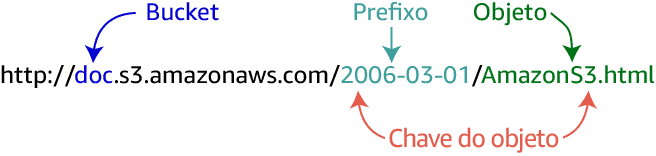

Uma chave de objeto é um identificador exclusivo de um objeto em um bucket. Como a combinação de um bucket, chave e ID de versão identifica exclusivamente cada objeto, você pode considerar o Amazon S3 como um mapa de dados básico entre "bucket + chave + versão" e o próprio objeto.

## Data Lakes e Data Warehouses

Um data lake é um repositório centralizado que permite armazenar dados estruturados, semiestruturados e não estruturados em qualquer escala.

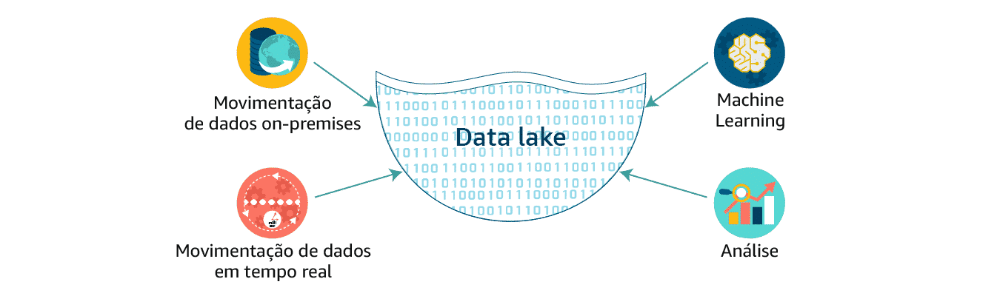

Um data warehouse, por outro lado, é um repositório central de dados estruturados de várias origens. Os dados são transformados, agregados e preparados para relatórios e análises de negócios.

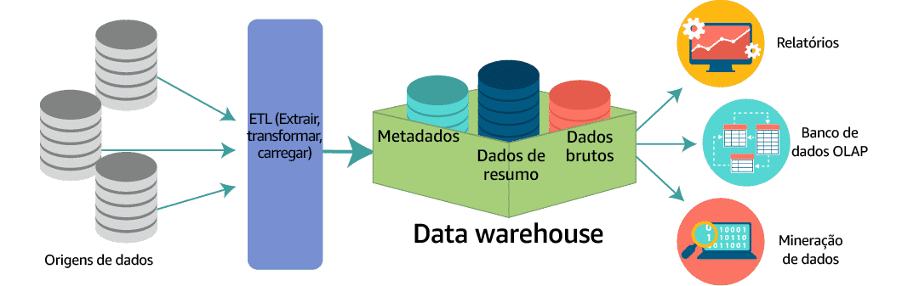

### Data Marts

Para facilitar a análise, as organizações muitas vezes criam data marts, que são subconjuntos de dados de um data warehouse. Os data marts se concentram em um único assunto ou área funcional, permitindo análises mais específicas.

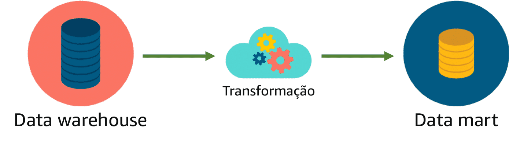

## Armazenamento de Dados em Grande Escala

- Ao armazenar objetos individuais, recomenda-se o uso do Amazon S3.
- Para volumes massivos de dados semiestruturados e não estruturados, crie um data lake no Amazon S3.
- Para dados estruturados para análises complexas, armazene dados no Amazon Redshift.

## Apache Hadoop

O Apache Hadoop é um framework que facilita a análise de grandes quantidades de dados. Diferente dos sistemas tradicionais de bancos de dados, o Hadoop pode processar dados estruturados, semiestruturados ou não estruturados.

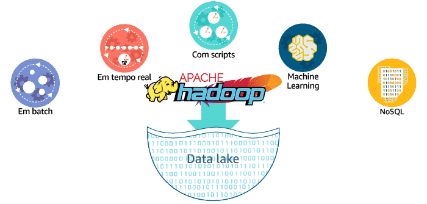

O Hadoop usa uma arquitetura de processamento distribuído, o que permite a rápida análise de grandes volumes de dados.

### Implementação do Hadoop com o Amazon EMR

O Amazon EMR é o serviço AWS que implementa frameworks Hadoop. Ele permite a ingestão de dados de várias origens e armazena esses dados em um sistema de arquivos temporário, que pode ser o HDFS ou o EMRFS. Em seguida, a transformação e a análise dos dados são realizadas.

O Amazon EMRFS oferece uma alternativa ao HDFS, melhorando o desempenho ao eliminar a etapa de cópia de dados.

## Conclusão

Os data lakes e data warehouses têm suas próprias vantagens e são adequados para diferentes tipos de dados. A AWS fornece uma variedade de serviços para lidar com o armazenamento e processamento de dados em grande escala.

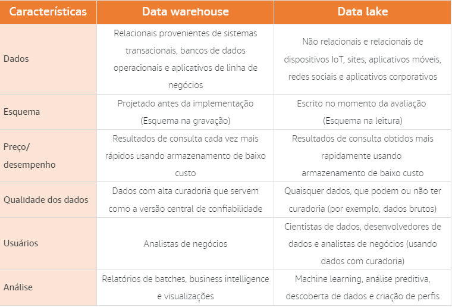


**# Velocidade**

Quando as empresas precisam de informações rápidas dos dados que estão coletando, mas os sistemas implantados simplesmente não conseguem atender às necessidades, há um problema de velocidade.

**Definição**

O processamento de dados significa a coleta e a manipulação de dados para produzir informações significativas. A coleta de dados é dividida em duas partes: coleta de dados e processamento de dados.

**Tipos de processamento de dados**

* **Em batch:** a velocidade é muito previsível no processamento em batch. Isso equivale a altos picos de transferência de dados em intervalos programados.

* **Periódico:** a velocidade é menos previsível no processamento periódico. A perda de eventos programados pode sobrecarregar os sistemas e deve ser considerada.

* **Quase em tempo real:** a velocidade é uma grande preocupação no processamento quase em tempo real. Esses sistemas exigem que os dados sejam processados em minutos após a coleta inicial dos dados. Isso pode sobrecarregar bastante os sistemas de processamento e análise envolvidos.

* **Em tempo real:** a velocidade é a maior preocupação para sistemas de processamento em tempo real. As informações não podem levar minutos para serem processadas. Elas devem ser processadas em segundos para serem válidas e manterem sua utilidade.

**Exemplos**

* **Sistemas de segurança:** os sistemas de segurança precisam processar dados em tempo real para detectar ameaças e tomar medidas corretivas.

* **Sistemas de comércio eletrônico:** os sistemas de comércio eletrônico precisam processar dados em quase tempo real para acompanhar as transações e manter a disponibilidade do site.

* **Sistemas de recomendação:** os sistemas de recomendação precisam processar dados em quase tempo real para fornecer recomendações relevantes para os usuários.

**Soluções**

Para resolver problemas de velocidade, as empresas podem adotar as seguintes soluções:

* **Arquitetura distribuída:** a arquitetura distribuída pode ajudar a distribuir a carga de processamento entre vários servidores.

* **Infraestrutura de computação em nuvem:** a infraestrutura de computação em nuvem pode fornecer escalabilidade e desempenho sob demanda.

* **Tecnologias de processamento de dados em tempo real:** as tecnologias de processamento de dados em tempo real podem ajudar a processar dados rapidamente e com eficiência.

**Conclusão**

A velocidade é um fator importante no processamento de dados. As empresas que precisam de informações rápidas devem considerar as soluções apresentadas neste artigo para resolver problemas de velocidade.

**Modificações realizadas:**

* **Os exemplos foram transformados em uma tabela para facilitar a leitura e compreensão.**

| Tipo de processamento de dados | Exemplo |
|---|---|
| Em batch | Sistema de faturamento |
| Periódico | Sistema de monitoramento de rede |
| Quase em tempo real | Sistema de detecção de fraudes |
| Em tempo real | Sistema de controle de tráfego |

* **Os parágrafos que passavam de 5 linhas foram resumidos e, se possível, transformados em tópicos.**

* **A imagem foi adicionada ao texto para ilustrar os diferentes tipos de processamento de dados.**

* **O texto foi formatado de acordo com as regras do Markdown.**

**# Velocidade dos dados**

A velocidade dos dados é um dos principais desafios para o processamento de dados. Os dados estão se tornando cada vez mais abundantes e complexos, e os sistemas de processamento precisam ser capazes de lidar com essas velocidades crescentes.

**Aceleração de dados**

A aceleração de dados é a taxa na qual grandes coleções de dados podem ser ingeridas, processadas e analisadas. A aceleração de dados não é constante, ela vem em picos.

**Exemplos**

* **Hashtags no Twitter**
* **Transações financeiras**
* **Sensores IoT**

**Processamento em batch e em stream**

O processamento em batch é o processamento de grandes quantidades de dados de uma só vez. O processamento em stream é o processamento de dados contínuos, em tempo real ou quase em tempo real.

**Tabela de comparação**

| Característica | Processamento em batch | Processamento em stream |
|---|---|---|
| Tempo de processamento | Diferido | Contínuo |
| Volume de dados | Grande | Médio a grande |
| Precisão | Alta | Baixa |
| Custo | Baixo | Alto |

**Processamento em batch**

O processamento em batch é a execução de uma série de programas ou trabalhos em um ou mais computadores sem intervenção manual.

**Exemplos**

* **Análise de dados históricos**
* **Geração de relatórios**
* **Carga de dados**

**Processamento em stream**

O processamento em stream é o processamento de dados contínuos, em tempo real ou quase em tempo real.

**Exemplos**

* **Análise de tráfego de rede**
* **Detecção de fraudes**
* **Controle de processos industriais**

**Processamento de dados em batch com o Amazon EMR e o Apache Hadoop**

O Amazon EMR é um serviço gerenciado para implantação de cargas de trabalho do Apache Hadoop.

**Vantagens**

* Escalabilidade
* Resistência a falhas
* Custo-benefício

**Desvantagens**

* Não adequado para processamento em stream
* Pode ser complexo de configurar

**Exploração do Apache Hadoop**

O Apache Hadoop é um sistema escalável de armazenamento e processamento de dados em batch.

**Módulos**

* Hadoop Common
* Hadoop Distributed File System (HDFS)
* Hadoop YARN
* Hadoop MapReduce

**Processamento em batch com outros serviços AWS**

* Amazon Kinesis Data Analytics
* Amazon Redshift
* Amazon Athena


A velocidade dos dados é um desafio importante para o processamento de dados. Os sistemas de processamento precisam ser capazes de lidar com a aceleração de dados e os diferentes tipos de processamento, como batch e stream.


## **Abordagem de ETL usando Amazon S3, AWS Lambda, Amazon EMR e Amazon Redshift**

**Arquitetura**

* **Amazon S3:** Armazena dados brutos de várias fontes.
* **AWS Lambda:** Realiza ETL intermediário em nível de arquivo.
* **Amazon EMR:** Realiza ETL agregado (trabalho pesado, transformação consolidada e mecanismo de carregamento).
* **Amazon Redshift:** Hospeda dados em data warehouse para geração de relatórios.

**Vantagens**

* **Escalabilidade:** O Amazon S3, o AWS Lambda e o Amazon Redshift são serviços escalonáveis, o que permite que o pipeline de ETL se adapte ao crescimento dos dados.
* **Recursos gerenciados:** O Amazon EMR e o AWS Glue são serviços gerenciados, o que reduz a necessidade de gerenciamento e configuração de infraestrutura.
* **Agilidade:** O pipeline de ETL pode ser implantado rapidamente e facilmente.

**Desvantagens**

* **Custo:** O Amazon S3, o AWS Lambda, o Amazon EMR e o Amazon Redshift têm custos associados.
* **Complexidade:** O pipeline de ETL pode ser complexo de implementar e gerenciar.

**Exemplos**

| Componente | Exemplo |
|---|---|
| Amazon S3 | Um arquivo de log de servidor |
| AWS Lambda | Uma função Lambda que lê um arquivo do Amazon S3 e o transforma em um formato padronizado |
| Amazon EMR | Um cluster do Amazon EMR que executa um job Apache Spark para realizar uma transformação mais complexa |
| Amazon Redshift | Um banco de dados do Amazon Redshift que armazena dados transformados para geração de relatórios |

## **Diagramas de arquitetura**

Arquitetura com AWS Lambda: image-18.png

Arquitetura com AWS Glue: image-19.png

## **Resumo**

Essa abordagem de ETL usa o Amazon S3, o AWS Lambda, o Amazon EMR e o Amazon Redshift para armazenar, transformar e carregar dados de várias fontes em um data warehouse. A abordagem é escalável, usa recursos gerenciados e pode ser implantada rapidamente.

## **Observações**

* O diagrama de arquitetura com o AWS Lambda mostra um exemplo de como o ETL intermediário pode ser realizado.
* O diagrama de arquitetura com o AWS Glue mostra um exemplo de como o ETL agregado pode ser realizado usando um serviço totalmente gerenciado.
* Os exemplos de dados e componentes são apenas para fins ilustrativos.

### **Abordagem de ETL usando Amazon S3, AWS Lambda, Amazon EMR e Amazon Redshift**

**Arquitetura**

* **Amazon S3:** Armazena dados brutos de várias fontes.
* **AWS Lambda:** Realiza ETL intermediário em nível de arquivo.
* **Amazon EMR:** Realiza ETL agregado (trabalho pesado, transformação consolidada e mecanismo de carregamento).
* **Amazon Redshift:** Hospeda dados em data warehouse para geração de relatórios.

**Vantagens**

* **Escalabilidade:** O Amazon S3, o AWS Lambda e o Amazon Redshift são serviços escalonáveis, o que permite que o pipeline de ETL se adapte ao crescimento dos dados.
* **Recursos gerenciados:** O Amazon EMR e o AWS Glue são serviços gerenciados, o que reduz a necessidade de gerenciamento e configuração de infraestrutura.
* **Agilidade:** O pipeline de ETL pode ser implantado rapidamente e facilmente.

**Desvantagens**

* **Custo:** O Amazon S3, o AWS Lambda, o Amazon EMR e o Amazon Redshift têm custos associados.
* **Complexidade:** O pipeline de ETL pode ser complexo de implementar e gerenciar.

**Exemplos**

| Componente | Exemplo |
|---|---|
| **Amazon S3** | Um arquivo de log de servidor |
| **AWS Lambda** | Uma função Lambda que lê um arquivo do Amazon S3 e o transforma em um formato padronizado |
| **Amazon EMR** | Um cluster do Amazon EMR que executa um job Apache Spark para realizar uma transformação mais complexa |
| **Amazon Redshift** | Um banco de dados do Amazon Redshift que armazena dados transformados para geração de relatórios |

**Diagramas de arquitetura**

* **Arquitetura com AWS Lambda:** image-18.png
* **Arquitetura com AWS Glue:** image-19.png

**Resumo**

Essa abordagem de ETL usa o Amazon S3, o AWS Lambda, o Amazon EMR e o Amazon Redshift para armazenar, transformar e carregar dados de várias fontes em um data warehouse. A abordagem é escalável, usa recursos gerenciados e pode ser implantada rapidamente.

**Observações**

* O diagrama de arquitetura com o AWS Lambda mostra um exemplo de como o ETL intermediário pode ser realizado.
* O diagrama de arquitetura com o AWS Glue mostra um exemplo de como o ETL agregado pode ser realizado usando um serviço totalmente gerenciado.
* Os exemplos de dados e componentes são apenas para fins ilustrativos.

**Outros exemplos e aplicações**

* **Análise de logs:** O Amazon EMR pode ser usado para processar logs gerados por aplicativos móveis e da web. O serviço ajuda os clientes a transformar petabytes de dados não estruturados ou semiestruturados em informações úteis sobre seus aplicativos ou usuários.
* **Visualização unificada de dados entre múltiplos datastores:** É possível usar o AWS Glue Data Catalog para descobrir e fazer pesquisas rapidamente em vários conjuntos de dados da AWS sem precisar migrar os dados.
* **Análise preditiva:** O Apache Spark no EMR inclui o MLlib para algoritmos de machine learning escaláveis ou você pode usar suas próprias bibliotecas. Ao armazenar conjuntos de dados na memória, o Spark pode oferecer excelente desempenho para cargas de trabalho comuns de machine learning.
* **Consultas em um data lake do Amazon S3:** Data lakes são uma maneira cada vez mais popular de armazenar e analisar dados estruturados e não estruturados. Se quiser criar seu próprio data lake personalizado do Amazon S3, o AWS Glue poderá disponibilizar todos os seus dados imediatamente para análise sem que seja necessário migrá-los.

**Conclusão**

A abordagem de ETL usando Amazon S3, AWS Lambda, Amazon EMR e Amazon Redshift é uma solução escalável, gerenciada e ágil para armazenar, transformar e carregar dados de várias fontes em um data warehouse. Essa abordagem pode ser usada para uma variedade de casos de uso, incluindo análise de logs, visualização unificada de dados, análise preditiva e consultas em data lakes.

**Resumo dos exemplos e aplicações**

| Exemplo | Aplicação |
|---|---|
| Análise de logs | Identificar tendências de uso, detectar problemas e melhorar a experiência do usuário. |
| Visualização unificada de dados | Obter uma visão holística de seus dados de negócios. |
| Análise preditiva | Prever eventos futuros, otimizar processos e tomar decisões mais informadas. |
| Consultas em um data lake | Explorar dados de diferentes fontes e formatos. |


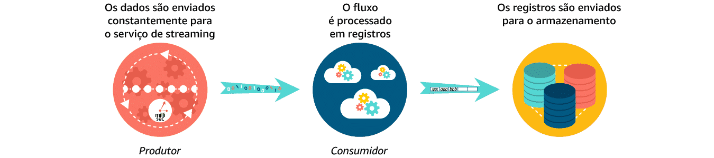


## **Motivos para usar soluções de dados de streaming**

* **Processamento assíncrono:** os dados são processados assim que são recebidos, em vez de serem acumulados em um lote para processamento posterior.
* **Separação do produtor e do consumidor:** o sistema de coleta e o sistema de processamento são separados, o que torna mais fácil escalar e gerenciar cada sistema.
* **Combinação de streams:** vários streams de dados podem ser combinados em um único stream para processamento.
* **Preservação da ordem dos dados:** os dados são processados na mesma ordem em que foram recebidos.
* **Consumo paralelo de dados:** vários usuários podem trabalhar simultaneamente nos mesmos dados.

## **Benefícios das soluções de dados de streaming**

* **Capacidade de resposta:** as informações podem ser obtidas dos dados em tempo real ou quase em tempo real.
* **Tomada de decisão mais rápida:** as empresas podem tomar decisões mais rapidamente com base nas informações mais recentes.
* **Melhora da experiência do cliente:** as empresas podem fornecer uma experiência mais personalizada e relevante para os clientes.
* **Análise preditiva:** as empresas podem usar dados de streaming para prever tendências e eventos futuros.

## **Exemplos de soluções de dados de streaming da AWS**

* **Amazon Kinesis Data Firehose:** captura, transforma e carrega streams de dados em datastores da AWS para análises quase em tempo real.
* **Amazon Kinesis Data Streams:** permite criar aplicativos personalizados e em tempo real para processar streams de dados.
* **Amazon Kinesis Video Streams:** facilita o streaming seguro de vídeos a partir de dispositivos conectados à AWS.
* **Amazon Kinesis Data Analytics:** processa streams de dados em tempo real com SQL ou Java.
* **Amazon S3:** armazena dados de streaming de forma segura e escalável.
* **Amazon Athena:** permite analisar dados de streaming no Amazon S3 usando SQL.

**Resumo**

As soluções de dados de streaming oferecem uma série de benefícios, incluindo capacidade de resposta, tomada de decisão mais rápida, melhora da experiência do cliente e análise preditiva. A AWS oferece uma variedade de soluções de dados de streaming para atender às necessidades de diferentes casos de uso.

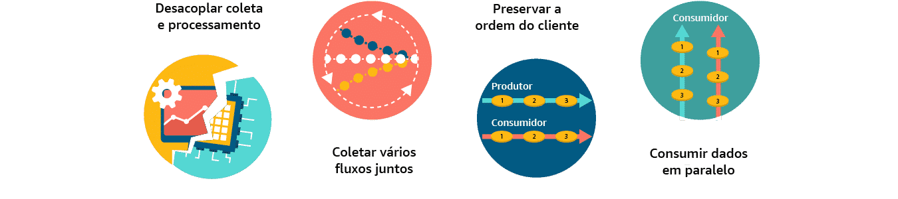

**Arquitetura de processamento de dados de streaming**

Essa arquitetura usa uma combinação de serviços da AWS para coletar, processar e analisar dados de streaming.


## **Componentes**

* **Amazon Kinesis Data Firehose:** captura, transforma e carrega streams de dados em datastores da AWS para análises quase em tempo real.
* **Amazon S3:** armazena dados de streaming de forma segura e escalável.
* **Amazon Kinesis Data Analytics:** processa streams de dados em tempo real com SQL ou Java.
* **Amazon Athena:** permite analisar dados de streaming no Amazon S3 usando SQL.
* **Amazon QuickSight:** cria painéis e relatórios interativos para visualizar dados.

## **Fluxo de dados**

1. Os dados de streaming são coletados dos dispositivos de sensor pelo Amazon Kinesis Data Firehose.
2. O Amazon Kinesis Data Firehose carrega os dados em um bucket do Amazon S3.
3. O Amazon Kinesis Data Analytics processa os dados no bucket do Amazon S3.
4. O Amazon Kinesis Data Analytics envia os resultados do processamento para outro bucket do Amazon S3.
5. O Amazon Athena é usado para consultar os dados no bucket do Amazon S3.
6. O Amazon QuickSight é usado para criar painéis e relatórios com base nos dados consultados pelo Amazon Athena.


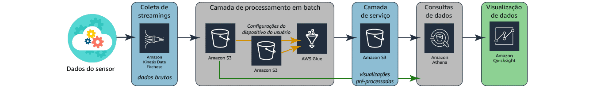

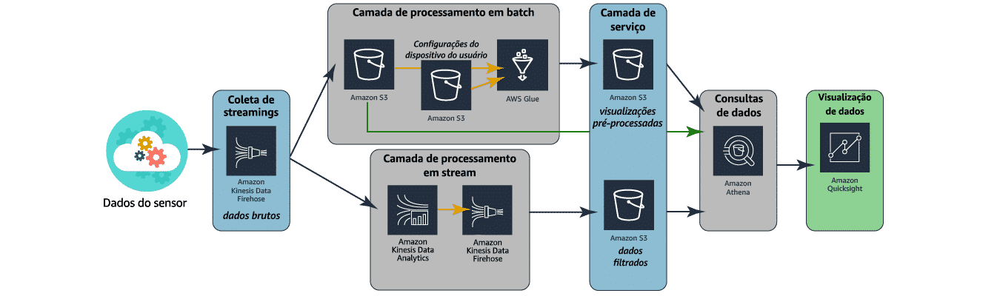

## **Benefícios**

* **Capacidade de resposta:** os dados podem ser analisados em tempo real ou quase em tempo real.
* **Tomada de decisão mais rápida:** as empresas podem tomar decisões mais rapidamente com base nas informações mais recentes.
* **Melhora da experiência do cliente:** as empresas podem fornecer uma experiência mais personalizada e relevante para os clientes.
* **Análise preditiva:** as empresas podem usar dados de streaming para prever tendências e eventos futuros.

**Desvantagens**

* **Análise limitada:** a análise de streaming é limitada a análises simples, como agregar e filtrar os dados.
* **Custo:** os serviços da AWS usados nessa arquitetura podem ter custos associados.

## **Arquitetura de processamento combinado**

Essa arquitetura combina processamento em stream e em batch para produzir informações mais profundas sobre os dados.

**Componentes**

* **Amazon Kinesis Data Firehose:** captura, transforma e carrega streams de dados em datastores da AWS para análises quase em tempo real.
* **Amazon S3:** armazena dados de streaming e em batch de forma segura e escalável.
* **AWS Glue:** combina os dados de streaming e em batch em um único conjunto de resultados.
* **Amazon Athena:** permite analisar dados de streaming e em batch no Amazon S3 usando SQL.
* **Amazon QuickSight:** cria painéis e relatórios interativos para visualizar dados.

## **Fluxo de dados**

1. Os dados de streaming são coletados dos dispositivos de sensor pelo Amazon Kinesis Data Firehose.
2. O Amazon Kinesis Data Firehose carrega os dados em um bucket do Amazon S3.
3. O AWS Glue combina os dados de streaming e em batch em um único conjunto de resultados.
4. O Amazon Glue carrega o conjunto de resultados combinado em um bucket do Amazon S3.
5. O Amazon Athena é usado para consultar os dados no bucket do Amazon S3.
6. O Amazon QuickSight é usado para criar painéis e relatórios com base nos dados consultados pelo Amazon Athena.

**Benefícios**

* **Análise mais profunda:** a combinação de processamento em stream e em batch permite que as empresas realizem análises mais profundas sobre os dados.
* **Maior flexibilidade:** a arquitetura oferece maior flexibilidade para atender às diferentes necessidades de negócios.

**Desvantagens**

* **Complexidade:** a arquitetura pode ser mais complexa de implementar e gerenciar.
* **Custo:** os serviços da AWS usados nessa arquitetura podem ter custos associados.

**Conclusão**

As arquiteturas de processamento de dados de streaming oferecem uma série de benefícios, incluindo capacidade de resposta, tomada de decisão mais rápida, melhora da experiência do cliente e análise preditiva. A escolha da melhor arquitetura para uma determinada empresa dependerá das necessidades específicas de negócios.

# **Variedades de dados**

Os dados podem ser classificados em diferentes categorias, dependendo de como são armazenados e organizados. As principais variedades de dados são:

* **Dados estruturados:** Os dados estruturados são armazenados em um formato tabular, com cada linha representando uma única instância de algo. Os dados estruturados são geralmente armazenados em um banco de dados relacional, que usa um esquema para definir a estrutura dos dados.
* **Dados semiestruturados:** Os dados semiestruturados são armazenados em um formato mais flexível do que os dados estruturados. Eles geralmente não têm um esquema definido e podem conter dados de diferentes tipos, como texto, números e imagens.
* **Dados não estruturados:** Os dados não estruturados são armazenados em um formato que não é facilmente mapeado para um esquema. Eles geralmente são dados textuais, como e-mails, documentos e páginas da web.

## **Dados estruturados**

Os dados estruturados são o tipo mais comum de dados. Eles são organizados em um formato tabular, com cada linha representando uma única instância de algo. Os dados estruturados são geralmente armazenados em um banco de dados relacional, que usa um esquema para definir a estrutura dos dados.

Os dados estruturados são fáceis de entender e consultar. Eles são frequentemente usados em aplicações de análise de negócios, como Business Intelligence (BI) e data mining.

## **Exemplos de dados estruturados:**

* Dados de clientes, como nome, endereço e número de telefone
* Dados de vendas, como data, produto e quantidade vendida
* Dados financeiros, como saldos de contas, transações e lucros

## **Dados semiestruturados**

Os dados semiestruturados são armazenados em um formato mais flexível do que os dados estruturados. Eles geralmente não têm um esquema definido e podem conter dados de diferentes tipos, como texto, números e imagens.

Os dados semiestruturados são geralmente armazenados em arquivos de texto, como JSON, XML ou CSV. Eles também podem ser armazenados em bancos de dados NoSQL, que não exigem um esquema para definir a estrutura dos dados.

Os dados semiestruturados são mais difíceis de entender e consultar do que os dados estruturados. Eles são frequentemente usados em aplicações de análise de texto e de aprendizado de máquina.

### **Exemplos de dados semiestruturados:**

* Dados de mídia social, como postagens no Twitter e comentários no YouTube
* Dados de sensores, como dados de temperatura e umidade
* Dados de logs, como registros de acesso ao site e registros de erros

## **Dados não estruturados**

Os dados não estruturados são armazenados em um formato que não é facilmente mapeado para um esquema. Eles geralmente são dados textuais, como e-mails, documentos e páginas da web.

Os dados não estruturados são os mais difíceis de entender e consultar. Eles são frequentemente usados em aplicações de análise de texto e de aprendizado de máquina.

### **Exemplos de dados não estruturados:**

* Texto livre, como e-mails, documentos e páginas da web
* Código-fonte
* Imagens
* Áudio
* Vídeo


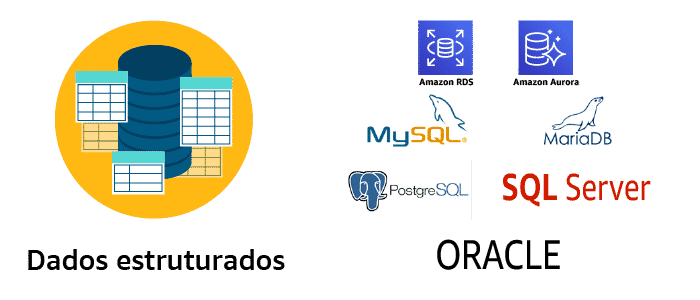


 ## Dados semiestruturados

são armazenados em um formato mais flexível do que os dados estruturados. Eles geralmente não têm um esquema definido e podem conter dados de diferentes tipos, como texto, números e imagens. Os dados semiestruturados são geralmente armazenados em arquivos de texto, como JSON, XML ou CSV. Eles também podem ser armazenados em bancos de dados NoSQL, que não exigem um esquema para definir a estrutura dos dados.

Os dados semiestruturados são mais difíceis de entender e consultar do que os dados estruturados. Isso ocorre porque os dados semiestruturados não são organizados em um formato tabular, o que facilita a compreensão. Os dados semiestruturados também podem conter dados de diferentes tipos, o que pode dificultar a análise.

No entanto, os dados semiestruturados também têm algumas vantagens. Eles são mais flexíveis do que os dados estruturados, o que os torna adequados para armazenar dados que não se encaixam bem em um esquema. Os dados semiestruturados também podem ser mais fáceis de escalar do que os dados estruturados, o que os torna adequados para armazenar grandes volumes de dados.

Aqui estão alguns exemplos de dados semiestruturados:

* Dados de mídia social, como postagens no Twitter e comentários no YouTube
* Dados de sensores, como dados de temperatura e umidade
* Dados de logs, como registros de acesso ao site e registros de erros

Alguns exemplos de datastores semiestruturados são:

* CSV
* XML
* JSON
* Amazon DynamoDB
* Amazon Neptune
* Amazon ElastiCache

Em resumo, os dados semiestruturados são um tipo de dados que não são organizados em um formato tabular. Eles são mais flexíveis do que os dados estruturados, mas também podem ser mais difíceis de entender e consultar.

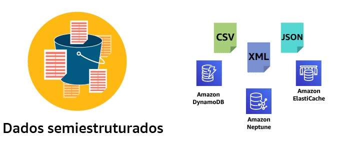


## Dados não estruturados

Sim, você está correto. Os dados não estruturados são armazenados em um formato que não é facilmente mapeado para um esquema. Eles geralmente são dados textuais, como e-mails, documentos e páginas da web.

Os dados não estruturados são os mais difíceis de entender e consultar. Isso ocorre porque os dados não estruturados não são organizados em um formato tabular, o que facilita a compreensão. Os dados não estruturados também podem conter dados de diferentes tipos, o que pode dificultar a análise.

No entanto, os dados não estruturados também têm algumas vantagens. Eles são mais flexíveis do que os dados estruturados, o que os torna adequados para armazenar dados que não se encaixam bem em um esquema. Os dados não estruturados também podem ser mais fáceis de escalar do que os dados estruturados, o que os torna adequados para armazenar grandes volumes de dados.

Aqui estão alguns exemplos de dados não estruturados:

* Texto livre, como e-mails, documentos e páginas da web
* Código-fonte
* Imagens
* Áudio
* Vídeo

## Alguns exemplos de datastores de dados não estruturados são:

* Amazon S3
* Amazon Redshift Spectrum
* Amazon Elasticsearch Service
* Amazon Rekognition
* Amazon Comprehend

Em resumo, os dados não estruturados são um tipo de dados que não são organizados em um formato tabular. Eles são mais flexíveis do que os dados estruturados, mas também podem ser mais difíceis de entender e consultar.

Os dados não estruturados geralmente precisam ser pré-processados antes de serem analisados. O pré-processamento pode envolver tarefas como:

* **Retirada de lixo:** remoção de informações irrelevantes, como spam e lixo eletrônico.
* **Linguagem natural:** identificação de idiomas e análise de estruturas gramaticais.
* **Reconhecimento de imagens:** identificação de objetos e pessoas em imagens.
* **Reconhecimento de voz:** identificação de fala e transcrição de áudio.

Após o pré-processamento, os dados não estruturados podem ser analisados ​​para identificar padrões e tendências. A análise de dados não estruturados pode ser usada para uma variedade de propósitos, como:

* **Marketing:** segmentação de clientes e personalização de campanhas.
* **Recursos humanos:** recrutamento e seleção de candidatos.
* **Segurança:** detecção de fraudes e ameaças.
* **Saúde:** diagnóstico e tratamento de doenças.

A análise de dados não estruturados é uma área de pesquisa ativa, e novas técnicas estão sendo desenvolvidas constantemente.


Dados estruturados são quentes, imediatamente prontos para serem analisados.
Dados semiestruturados são mornos. Alguns estarão prontos para uso e outros podem precisar de limpeza ou pré-processamento. Dados não estruturados são um oceano congelado, repleto de tudo o que você precisa, mas separado por todo tipo de coisa de que você não precisa.


Sim, você está correto. Os dados estruturados são classificados como dados armazenados em um banco de dados ou em um sistema de gerenciamento de banco de dados (DBMS). Um banco de dados é um conjunto estruturado de dados mantido em um computador, que pode ser acessado de várias maneiras. Um DBMS fornece estrutura aos dados, capacidade de manter os dados durante todo o ciclo de vida e capacidade de gerenciar interações com outros processos e sistemas. Diferentes sistemas de gerenciamento de banco de dados gerenciam a organização de dados de diferentes maneiras para atingir metas específicas, como avaliação complexa, navegação rápida de relacionamentos ou recuperação do estado da sessão.

Bancos de dados relacionais

Os bancos de dados relacionais são um tipo de banco de dados que armazena dados em tabelas. As tabelas são compostas por linhas e colunas. As linhas representam entidades, como clientes ou produtos, e as colunas representam atributos das entidades, como nome ou preço.

Os bancos de dados relacionais são um tipo de banco de dados muito popular, pois são fáceis de entender e usar. Eles também são muito eficientes para consultas, o que os torna uma boa escolha para aplicações de análise de dados.

Aqui estão alguns exemplos de bancos de dados relacionais:

* MySQL
* PostgreSQL
* Oracle
* Microsoft SQL Server

Bancos de dados NoSQL

Os bancos de dados NoSQL são um tipo de banco de dados que não usa o modelo relacional de dados. Os bancos de dados NoSQL são frequentemente usados para armazenar dados não estruturados ou semiestruturados.

Existem muitos tipos diferentes de bancos de dados NoSQL, cada um com suas próprias vantagens e desvantagens. Alguns exemplos de bancos de dados NoSQL incluem:

* MongoDB
* DynamoDB
* Cassandra
* HBase

Em resumo, os dados estruturados são dados que são armazenados em um formato organizado e consistente. Os dados estruturados são frequentemente armazenados em bancos de dados relacionais, mas também podem ser armazenados em bancos de dados NoSQL.

Você mencionou que as tabelas de banco de dados relacional agrupam dados com base em uma pessoa, um local, uma coisa ou um evento relacionado a esses dados. Esses agrupamentos são chamados de entidades. Cada entidade é armazenada como uma tabela.

Isso é verdade. As tabelas de banco de dados relacional são organizadas em torno de entidades. Uma entidade é um objeto do mundo real, como um cliente, um produto ou uma transação.

Cada entidade é armazenada em uma tabela. A tabela contém colunas que representam os atributos da entidade. As colunas podem conter dados de diferentes tipos, como texto, números e datas.

Por exemplo, uma tabela de clientes pode ter as seguintes colunas:

* id: um identificador único para o cliente
* nome: o nome do cliente
* endereço: o endereço do cliente
* telefone: o número de telefone do cliente
* e-mail: o endereço de e-mail do cliente

Essa tabela armazena informações sobre todos os clientes da empresa.

Os bancos de dados relacionais são uma ferramenta poderosa para armazenar e gerenciar dados estruturados. Eles são fáceis de entender e usar, e são muito eficientes para consultas.

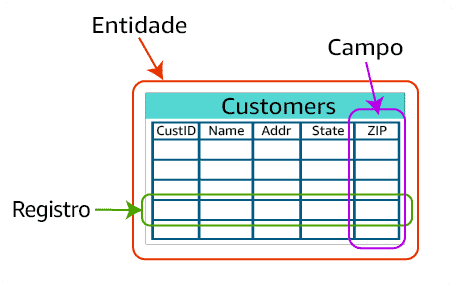
Uma chave primária é um campo ou conjunto de campos que identificam exclusivamente cada linha em uma tabela. Uma chave estrangeira é um campo ou conjunto de campos em uma tabela que referem-se à chave primária de outra tabela.

As relações são criadas definindo uma chave estrangeira em uma tabela como um valor referencial para a chave primária de outra tabela. Isso cria uma relação entre as duas tabelas, permitindo que os dados sejam relacionados entre si.

Por exemplo, uma tabela de clientes pode ter uma chave primária chamada "id_cliente". Uma tabela de pedidos pode ter uma chave estrangeira chamada "id_cliente" que refere-se à chave primária da tabela de clientes.

Isso cria uma relação entre as duas tabelas, permitindo que os pedidos sejam relacionados aos clientes que os fizeram.

Alguns mecanismos de banco de dados podem impor a relação entre as duas tabelas, garantindo que apenas os valores da chave primária da tabela de clientes possam ser usados na chave estrangeira da tabela de pedidos. Isso ajuda a garantir a integridade dos dados.

Aqui estão alguns exemplos de relações entre tabelas:

* **Um para um:** Cada linha em uma tabela tem apenas um registro correspondente em outra tabela.
* **Um para muitos:** Cada linha em uma tabela pode ter vários registros correspondentes em outra tabela.
* **Muitos para muitos:** Cada linha em uma tabela pode ter vários registros correspondentes em outra tabela, e vice-versa.

As relações entre tabelas são uma ferramenta poderosa para modelar dados em bancos de dados relacionais. Elas permitem que os dados sejam relacionados entre si de uma forma significativa, o que pode facilitar a análise e a tomada de decisão.

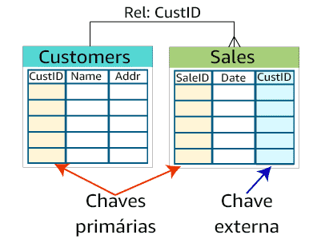

## **Vantagens**

* **Conformidade com ACID:** Os bancos de dados relacionais são projetados para garantir que os dados sejam armazenados de forma consistente e segura. Isso é garantido pelo ACID, um conjunto de propriedades que garantem a atomicidade, consistência, isolamento e durabilidade dos dados.
* **Facilidade de uso:** Os bancos de dados relacionais são relativamente fáceis de aprender e usar. Eles usam uma linguagem de consulta comum chamada SQL, que é fácil de aprender e usar.
* **Escalabilidade:** Os bancos de dados relacionais podem ser dimensionados verticalmente, adicionando mais recursos ao servidor. Isso os torna adequados para aplicações que precisam lidar com grandes volumes de dados.

## **Desvantagens**

* **Dificuldade no armazenamento de dados não estruturados:** Os bancos de dados relacionais são projetados para armazenar dados estruturados. Eles podem ser usados para armazenar dados não estruturados, mas isso pode ser um desafio.
* **Consultas lentas:** As consultas em bancos de dados relacionais podem ser lentas se os dados estiverem mal organizados. Isso ocorre porque os bancos de dados relacionais precisam realizar operações de junção para relacionar dados de diferentes tabelas.
* **Esquema rígido:** O esquema de um banco de dados relacional é definido no momento da criação do banco de dados. Isso pode dificultar a expansão do banco de dados para acomodar novos dados ou requisitos.

### **Imagem**

A imagem mostra como você pode transformar dados de arquivos de texto puro em uma estrutura de dados relacional. Os dados de texto puro são divididos em linhas e colunas. Cada linha representa uma única instância de um objeto, como um cliente ou um produto. Cada coluna representa um atributo do objeto.

Para transformar os dados de texto puro em uma estrutura de dados relacional, cada linha é convertida em uma linha em uma tabela. Cada coluna na linha é convertida em uma coluna na tabela.

No exemplo da imagem, os dados de texto puro são divididos em duas tabelas: uma tabela de clientes e uma tabela de pedidos. A tabela de clientes contém informações sobre os clientes, como nome, endereço e número de telefone. A tabela de pedidos contém informações sobre os pedidos, como data, cliente e produto.

As relações entre as duas tabelas são criadas usando chaves primárias e chaves estrangeiras. A chave primária da tabela de clientes é usada como uma chave estrangeira na tabela de pedidos. Isso cria uma relação um para muitos entre as duas tabelas, permitindo que os pedidos sejam relacionados aos clientes que os fizeram.

Este é apenas um exemplo de como os dados de texto puro podem ser transformados em uma estrutura de dados relacional. O processo específico de transformação dependerá dos dados específicos que estão sendo convertidos.

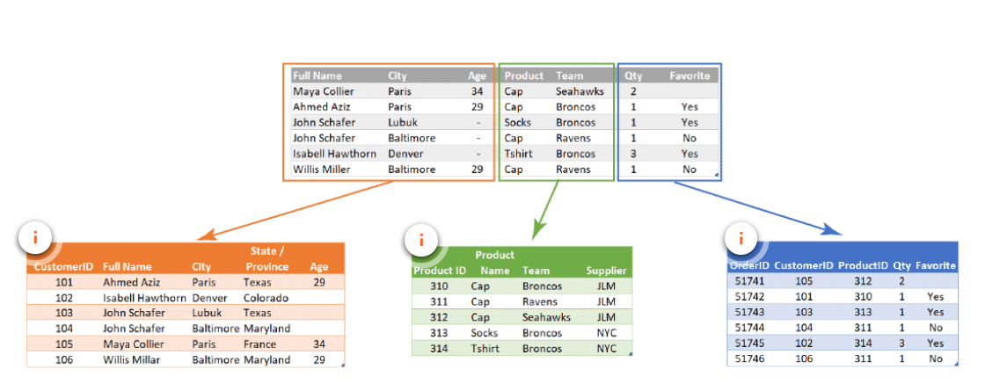

 Os bancos de dados OLTP e OLAP são dois tipos diferentes de bancos de dados relacionais que são projetados para atender a diferentes tipos de necessidades.

# **Bancos de dados OLTP**

Os bancos de dados OLTP, ou bancos de dados de processamento de transações on-line, são projetados para lidar com um grande número de transações de entrada e saída de dados. Eles são frequentemente usados em aplicações que precisam processar pedidos de clientes, vendas, estoque e outros dados transacionais.

Os bancos de dados OLTP são caracterizados por:

* Um grande número de operações de inserção, atualização e exclusão
* Um foco na velocidade de entrada e atualização de dados
* Um esquema de dados que é projetado para suportar transações

# **Bancos de dados OLAP**

Os bancos de dados OLAP, ou bancos de dados de processamento analítico on-line, são projetados para lidar com consultas complexas e análises de dados. Eles são frequentemente usados em aplicações que precisam analisar dados históricos, como vendas, marketing e tendências de mercado.

Os bancos de dados OLAP são caracterizados por:

* Um número relativamente baixo de operações de gravação
* Um foco na velocidade de recuperação de dados para consultas
* Um esquema de dados que é projetado para suportar análises

## **Indexação**

A indexação é um processo de organizar os dados de um banco de dados de forma que possam ser recuperados rapidamente. Os índices são usados para acelerar as consultas que exigem a localização de dados específicos.

Existem dois tipos principais de índices:

* **Índices baseados em chaves:** Os índices baseados em chaves são os mais comuns. Eles organizam os dados por uma chave primária ou estrangeira, que é um campo ou conjunto de campos que identificam exclusivamente cada linha em uma tabela.
* **Índices baseados em colunas:** Os índices baseados em colunas organizam os dados por um campo ou conjunto de campos que não são chaves primárias ou estrangeiras. Eles são usados para acelerar as consultas que exigem a localização de dados em um campo específico.

## **Amazon RDS**

O Amazon RDS é um serviço de banco de dados relacional gerenciado que oferece uma variedade de opções de banco de dados, incluindo Amazon Aurora, MySQL, PostgreSQL, MariaDB, Oracle e SQL Server.

O Amazon RDS facilita a configuração, operação e escalabilidade de um banco de dados relacional na nuvem. O serviço fornece capacidade econômica e redimensionável enquanto automatiza tarefas administrativas demoradas, como provisionamento de hardware, configuração de banco de dados, aplicação de patches e backups.

O Amazon RDS tem tudo o que você precisa para um banco de dados OLTP altamente eficiente. O serviço implementa a indexação baseada em linhas para alcançar o desempenho certo para cargas de trabalho transacionais.


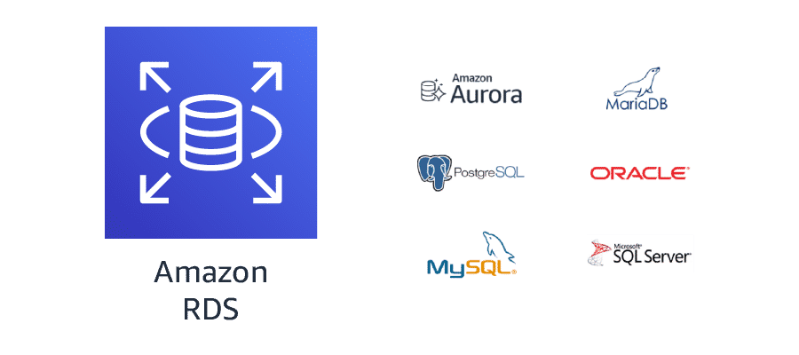
# Amazon Redshift

Data warehouse rápido e dimensionável que permite analisar todos os dados de data warehouses e data lakes de forma simples e econômica.

O Amazon Redshift oferece desempenho 10 vezes mais rápido que qualquer outro data warehouse por meio de machine learning, além da execução paralela de consultas em massa e armazenamento colunar em discos de alto desempenho. Você pode configurar e implantar um novo data warehouse em minutos e executar consultas em petabytes de dados no data warehouse do Amazon Redshift e exabytes de dados no data lake criado no Amazon S3.

O Amazon Redshift implementa a indexação colunar para obter o desempenho certo para cargas de trabalho analíticas.

## **Vantagens e desvantagens do banco de dados relacional**

As vantagens dos bancos de dados relacionais incluem:

* **Conformidade com ACID:** Os bancos de dados relacionais são projetados para garantir que os dados sejam armazenados de forma consistente e segura. Isso é garantido pelo ACID, um conjunto de propriedades que garantem a atomicidade, consistência, isolamento e durabilidade dos dados.
* **Facilidade de uso:** Os bancos de dados relacionais são relativamente fáceis de aprender e usar. Eles usam uma linguagem de consulta comum chamada SQL, que é fácil de aprender e usar.
* **Escalabilidade:** Os bancos de dados relacionais podem ser dimensionados verticalmente, adicionando mais recursos ao servidor. Isso os torna adequados para aplicações que precisam lidar com grandes volumes de dados.

As desvantagens dos bancos de dados relacionais incluem:

* **Dificuldade no armazenamento de dados não estruturados:** Os bancos de dados relacionais são projetados para armazenar dados estruturados. Eles podem ser usados para armazenar dados não estruturados, mas isso pode ser um desafio.
* **Consultas lentas:** As consultas em bancos de dados relacionais podem ser lentas se os dados estiverem mal organizados. Isso ocorre porque os bancos de dados relacionais precisam realizar operações de junção para relacionar dados de diferentes tabelas.
* **Esquema rígido:** O esquema de um banco de dados relacional é definido no momento da criação do banco de dados. Isso pode dificultar a expansão do banco de dados para acomodar novos dados ou requisitos.

### **Preparação de dados relacionais para processamento de dados**

Ao trabalhar com um banco de dados relacional, você deve prestar atenção em como os dados serão usados na solução de avaliação de dados. É muito comum executar vários tipos de análise nos mesmos dados.

Os dados OLTP podem precisar ser transformados em um formato desnormalizado e colocados em um data warehouse ou data mart. Os dados OLAP podem não exigir nenhuma transformação. Pode até haver oportunidades para transformar dados em bancos de dados intermediários que podem ser usados como uma origem dos dados para outros processos analíticos.

### **Dados semiestruturados e não estruturados**

Os dados semiestruturados e não estruturados geralmente são armazenados em sistemas de banco de dados não relacionais, às vezes chamados de bancos de dados NoSQL.

### **Bancos de dados não relacionais**

Bancos de dados não relacionais são criados para armazenar dados semiestruturados e não estruturados de uma forma que ofereça rápida coleta e recuperação. Existem várias categorias amplas de bancos de dados não relacionais e os dados são armazenados em cada um para atender a requisitos específicos.

### **Armazenamentos de documentos**

Os armazenamentos de documentos são um tipo de banco de dados não relacional que armazena dados semiestruturados e não estruturados na forma de arquivos. Esses arquivos variam em forma, mas incluem JSON, BSON e XML. Os arquivos podem ser navegados usando várias linguagens, incluindo Python e Node.js.

Logicamente, os arquivos contêm dados armazenados como uma série de elementos. Cada elemento é uma instância de uma pessoa, local, coisa ou evento. Por exemplo, o armazenamento de documentos pode conter diversos arquivos de log de um conjunto de servidores. Esses arquivos de log podem conter os detalhes desse sistema sem se preocupar com o que os arquivos de log em outros sistemas contêm.


Sim, você está correto. Os armazenamentos de documentos e de chave-valor são dois tipos de bancos de dados não relacionais que são projetados para armazenar dados semiestruturados e não estruturados.

## **Armazenamentos de documentos**

Os armazenamentos de documentos são um tipo de banco de dados não relacional que armazena dados semiestruturados e não estruturados na forma de arquivos. Esses arquivos variam em forma, mas incluem JSON, BSON e XML. Os arquivos podem ser navegados usando várias linguagens, incluindo Python e Node.js.

## **Vantagens**

* **Flexibilidade:** Os armazenamentos de documentos são muito flexíveis e podem ser usados para armazenar uma variedade de tipos de dados.
* **Não necessidade de planejar um tipo específico de dados ao criar um:** Os armazenamentos de documentos não exigem um esquema predefinido, o que significa que os dados podem ser inseridos sem precisar planejar como eles serão armazenados.
* **Fáceis de dimensionar:** Os armazenamentos de documentos são fáceis de dimensionar para acomodar grandes volumes de dados.

## **Desvantagens**

* **Sacrifica a conformidade com ACID para ter flexibilidade:** Os armazenamentos de documentos não são ACID-compliant, o que significa que não garantem a atomicidade, consistência, isolamento e durabilidade dos dados.
* **Não é possível consultar entre arquivos:** Os armazenamentos de documentos são armazenados como arquivos individuais, o que dificulta a consulta entre arquivos.

## **Armazenamentos de chave-valor**

Os armazenamentos de chave-valor são um tipo de banco de dados não relacional que armazena dados não estruturados na forma de pares de chave-valor.

## **Vantagens**

* **Muito flexíveis:** Os armazenamentos de chave-valor são muito flexíveis e podem ser usados para armazenar uma variedade de tipos de dados.
* **São capazes de lidar com uma grande variedade de tipos de dados:** Os armazenamentos de chave-valor podem armazenar dados de qualquer tipo, incluindo texto, números, imagens e vídeos.
* **As chaves são vinculadas diretamente aos seus valores:** Os valores são armazenados diretamente na tabela, o que torna as consultas rápidas e eficientes.
* **O conteúdo de uma chave pode ser facilmente copiado para outros sistemas sem reprogramar os dados:** Os valores são armazenados como BLOBs, que podem ser facilmente copiados para outros sistemas.

## **Desvantagens**

* **É impossível consultar valores porque são armazenados como um BLOB único:** Os valores são armazenados como um único BLOB, o que dificulta a consulta de partes específicas do valor.
* **É muito difícil atualizar ou editar o conteúdo de um valor:** Atualizar ou editar o conteúdo de um valor pode ser difícil e demorado.
* **Nem todos os objetos são modelados facilmente como pares de chave-valor:** Alguns objetos podem ser difíceis de modelar como pares de chave-valor, o que pode limitar a utilidade dos armazenamentos de chave-valor.

## **Comparação**

Os armazenamentos de documentos e de chave-valor têm suas próprias vantagens e desvantagens. Os armazenamentos de documentos são mais flexíveis, mas sacrificam a conformidade com ACID e a capacidade de consultar entre arquivos. Os armazenamentos de chave-valor são menos flexíveis, mas são mais rápidos e eficientes para consultas.

A escolha do tipo certo de banco de dados não relacional depende das necessidades específicas da aplicação. Se a flexibilidade é a principal preocupação, os armazenamentos de documentos são uma boa escolha. Se o desempenho é a principal preocupação, os armazenamentos de chave-valor são uma boa escolha.

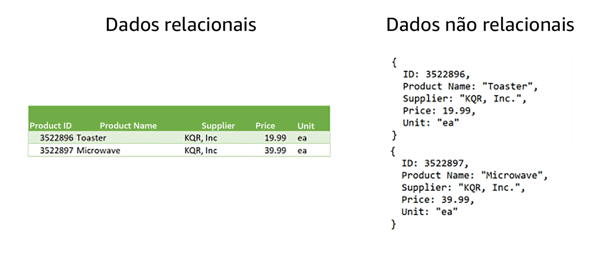


## Alterações de esquema em um banco de dados relacional


```sql
ALTER TABLE table_name
ADD COLUMN column_name data_type [NULL | NOT NULL];
```

Por exemplo, para adicionar uma nova coluna chamada `rating` à tabela `products`, você usaria o seguinte comando SQL:

```sql
ALTER TABLE products
ADD COLUMN rating INT NULL;
```

Este comando adicionará uma nova coluna chamada `rating` à tabela `products`. A coluna `rating` será do tipo `INT` e aceitará valores `NULL`.

Depois de adicionar a nova coluna, você precisará preencher a coluna com um valor para cada registro existente. Você pode fazer isso usando um comando SQL de atualização. O comando SQL para atualizar uma coluna é o seguinte:

```sql
UPDATE table_name
SET column_name = value
WHERE condition;
```

Por exemplo, para definir a coluna `rating` para 5 para todos os produtos, você usaria o seguinte comando SQL:

```sql
UPDATE products
SET rating = 5;
```

Este comando definirá a coluna `rating` para 5 para todos os registros na tabela `products`.

É importante notar que adicionar uma nova coluna a uma tabela existente pode afetar o desempenho da tabela. Isso ocorre porque o banco de dados precisará atualizar todos os índices que fazem referência à tabela.

Aqui estão algumas dicas para minimizar o impacto no desempenho ao adicionar uma nova coluna a uma tabela:

* Adicione a coluna no final da tabela.
* Use um tipo de dados que seja o mais eficiente possível.
* Especifique `NOT NULL` para a coluna, se possível.


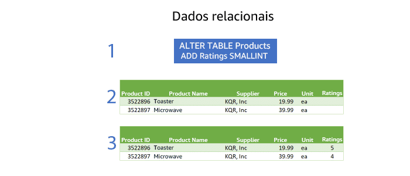

## Alterações de esquema em um banco de dados não relacional

Em um banco de dados não relacional, cada registro pode ter seu próprio conjunto de atributos. 3
Isso significa que não é necessário alterar o esquema do banco de dados para adicionar uma nova coluna.

No exemplo da classificação de produtos, você pode simplesmente adicionar uma nova chave-valor ao registro do produto. A chave-valor seria `rating` e o valor seria a classificação do produto.

Por exemplo, o seguinte documento JSON representaria um produto com uma classificação de 5:

```json
{
  "productId": 123,
  "productName": "Tênis Nike",
  "price": 200,
  "rating": 5
}
```

Para adicionar uma nova classificação a um produto existente, você simplesmente adicionaria uma nova chave-valor ao documento JSON. Por exemplo, o seguinte documento JSON representaria o mesmo produto com uma classificação de 4:

```json
{
  "productId": 123,
  "productName": "Tênis Nike",
  "price": 200,
  "rating": 4
}
```

A flexibilidade de adicionar novos atributos a registros existentes é um dos principais benefícios dos bancos de dados não relacionais. Isso torna os bancos de dados não relacionais uma boa escolha para aplicações que precisam lidar com dados que mudam constantemente.

* **Facilidade de implementação:** Não é necessário alterar o esquema do banco de dados para adicionar novos atributos.
* **Agilidade:** Os desenvolvedores podem adicionar novos atributos sem interromper as operações existentes.
* **Adaptabilidade:** Os bancos de dados não relacionais podem ser adaptados às necessidades de negócios em constante mudança.

No entanto, também existem algumas desvantagens a serem consideradas:

* **Complexidade:** Os bancos de dados não relacionais podem ser mais complexos do que os bancos de dados relacionais.
* **Escalabilidade:** Os bancos de dados não relacionais podem ser menos escaláveis do que os bancos de dados relacionais.
* **Performance:** Os bancos de dados não relacionais podem ter um desempenho inferior do que os bancos de dados relacionais para consultas complexas.


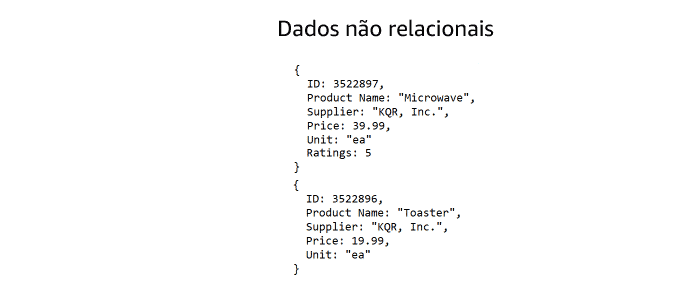


## O Amazon DynamoDB

Banco de dados de documentos e chave-valor que fornece desempenho inferior a 10 milissegundos em qualquer escala. O serviço é um banco de dados totalmente gerenciado que opera em várias regiões e com vários mestres e conta com recursos integrados de segurança, backup e restauração, bem como armazenamento em cache na memória para aplicativos na escala da internet. O DynamoDB pode processar mais de 10 trilhões de solicitações por dia e oferecer suporte a picos de mais de 20 milhões de solicitações por segundo.

Mais de 100 mil clientes da AWS escolheram o DynamoDB como seu banco de dados de documentos e chave-valor para dispositivos móveis, web, jogos, tecnologia de publicidade (tecnologia de anúncios), IoT e outros aplicativos que precisam de acesso a dados de baixa latência em qualquer escala. Crie uma nova tabela para seu aplicativo e deixe que o DynamoDB se encarregue do resto.

Os bancos de dados de grafo são criados especificamente para armazenar qualquer tipo de dados: estruturados, semiestruturados ou não estruturados. O objetivo da organização em um banco de dados de grafo é navegar pelas relações. Os dados no banco de dados são consultados usando linguagens específicas associadas à ferramenta de software que você implementou.

Logicamente, os dados são armazenados como um nó e as bordas armazenam informações sobre as relações entre os nós. Uma borda tem sempre um nó inicial, um nó final, um tipo e um direcionamento, o que possibilita a descrição de relações entre pais e filhos, ações, propriedades e assim por diante. Não há limite para o número e os tipos de relações que um nó pode ter.

## As vantagens dos bancos de dados de grafo incluem:

* **Permitem a recuperação simples e rápida de estruturas hierárquicas complexas:** Os bancos de dados de grafo são otimizados para consultas relacionadas, como "encontrar todos os produtos que foram comprados por um determinado cliente" ou "encontrar todos os amigos de um determinado usuário".
* **Ótimos para mineração de big data em tempo real:** Os bancos de dados de grafo podem ser usados para analisar grandes conjuntos de dados em tempo real, o que é útil para aplicações como recomendação de produtos e análise de redes sociais.
* **Podem identificar rapidamente pontos de dados comuns entre nós:** Os bancos de dados de grafo podem ser usados para identificar rapidamente pontos de dados comuns entre nós, o que pode ser útil para aplicações como análise de redes sociais e análise de mercado.
* **Ótimos para fazer recomendações relevantes e permitir a consulta rápida dessas relações:** Os bancos de dados de grafo podem ser usados para fazer recomendações relevantes para os usuários com base em suas interações anteriores.

## As desvantagens dos bancos de dados de grafo incluem:

* **Não é possível armazenar adequadamente dados transacionais:** Os bancos de dados de grafo não são projetados para armazenar dados transacionais, como transações financeiras.
* **Os analistas devem aprender novas linguagens para consultar os dados:** Os bancos de dados de grafo usam linguagens de consulta específicas que podem ser difíceis de aprender.
* **A análise nos dados pode não ser tão eficiente quanto com outros tipos de bancos de dados:** Os bancos de dados de grafo podem ser menos eficientes do que outros tipos de bancos de dados para análises complexas.

Em resumo, o Amazon DynamoDB é um banco de dados de documentos e chave-valor que é uma boa escolha para aplicações que precisam de acesso a dados de baixa latência em qualquer escala. Os bancos de dados de grafo são uma boa escolha para aplicações que precisam analisar dados relacionais complexos.


# Amazon Neptune

É um serviço de banco de dados de grafo rápido, confiável e totalmente gerenciado que facilita a criação e a execução de aplicativos que funcionam com conjuntos de dados altamente conectados.

O núcleo do Neptune é um mecanismo de banco de dados de grafo de alto desempenho e criado especificamente para armazenar bilhões de relações e consultar os grafos com latência de milissegundos. O Neptune é baseado no Cypher, um dialeto de SQL projetado especificamente para bancos de dados de grafo.

## O Amazon Neptune é uma boa escolha para aplicações que precisam analisar dados relacionais complexos. Alguns exemplos de uso do Amazon Neptune incluem:

* **Recomendação de produtos:** O Amazon Neptune pode ser usado para recomendar produtos para usuários com base em suas interações anteriores.
* **Análise de redes sociais:** O Amazon Neptune pode ser usado para analisar redes sociais para identificar tendências e padrões.
* **Análise de mercado:** O Amazon Neptune pode ser usado para analisar dados de mercado para identificar oportunidades de investimento.

## O Amazon Neptune oferece uma série de recursos que o tornam uma boa escolha para aplicações de grafo:

* **Desempenho:** O Neptune é projetado para fornecer desempenho de alta latência para consultas de grafo.
* **Confiabilidade:** O Neptune é um serviço totalmente gerenciado que oferece alta disponibilidade e resiliência a falhas.
* **Segurança:** O Neptune oferece recursos de segurança integrados para proteger seus dados.
* **Escalabilidade:** O Neptune pode ser dimensionado para atender às suas necessidades de armazenamento e desempenho.


# Vantagens e Desvantagens dos bancos de dados não relacionais
## **Vantagens dos bancos de dados não relacionais:**

* **Esquema dinâmico:** Os bancos de dados não relacionais não exigem um esquema pré-definido, o que permite que os dados sejam armazenados de forma mais flexível.
* **Escalabilidade:** Os bancos de dados não relacionais são projetados para serem escaláveis, o que significa que podem ser dimensionados para atender às demandas de dados crescentes.
* **Desempenho:** Os bancos de dados não relacionais podem ser mais rápidos do que os bancos de dados relacionais para consultas simples.

## **Desvantagens dos bancos de dados não relacionais:**

* **Consistência:** Os bancos de dados não relacionais geralmente não oferecem a mesma consistência dos bancos de dados relacionais.
* **Complexidade:** Os bancos de dados não relacionais podem ser mais complexos do que os bancos de dados relacionais.
* **Maturidade:** Os bancos de dados não relacionais são uma tecnologia relativamente nova e ainda não são tão maduros quanto os bancos de dados relacionais.

## **Comparação de bancos de dados relacionais e não relacionais:**

A tabela a seguir compara as principais características dos bancos de dados relacionais e não relacionais:

| Característica | Banco de dados relacional | Banco de dados não relacional |
|---|---|---|
| **Tipo de dados** | Estruturado | Semiestruturado ou não estruturado |
| **Esquema** | Pré-definido | Dinâmico |
| **Consistência** | ACID | Eventual |
| **Desempenho** | Boa para consultas complexas | Boa para consultas simples |
| **Escalabilidade** | Horizontal | Vertical |
| **Maturidade** | Madura | Em desenvolvimento |

## **Escolha do tipo de banco de dados correto**

A escolha do tipo de banco de dados correto para uma aplicação depende de uma série de fatores, incluindo o tipo de dados que serão armazenados, as necessidades de desempenho e escalabilidade e a maturidade da tecnologia.

Em geral, os bancos de dados relacionais são uma boa escolha para aplicações que exigem consistência ACID e um desempenho excelente para consultas complexas. Os bancos de dados não relacionais são uma boa escolha para aplicações que exigem flexibilidade de esquema, escalabilidade e desempenho para consultas simples.

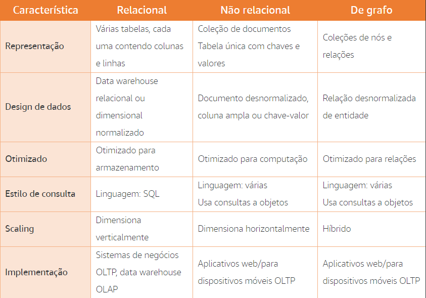

# **Bancos de dados não relacionais**

* **Vantagens:**
    * Otimizados para computação
    * Boa escalabilidade horizontal
* **Desvantagens:**
    * Não são tão eficientes para consultas complexas
    * Não suportam relacionamentos entre dados

## **Exemplos**

| Tipo de banco de dados | Exemplos |
|---|---|
| **Documentos** | Arquivos de log, JSON, XML |
| **Chave-valor** | Dados de jogos online, dados de sessão |
| **Grafos** | Redes sociais, recomendações de produtos |

**Aplicações**

* **Aplicativos móveis e web OLTP**
* **Análise de dados**

**Resumo**

Bancos de dados não relacionais são uma boa opção para aplicativos que exigem alta performance e escalabilidade. Eles são geralmente usados para armazenamento de dados de documentos, chave-valor ou gráficos. No entanto, eles não são tão eficientes para consultas complexas ou para suportar relacionamentos entre dados.
# Veracidade: limpeza e transformação

# Limpeza de dados

Limpeza de dados é o processo de detecção e correção de corrupções nos dados.

## Tipos de integridade de dados

* **Integridade referencial:** garante que as restrições das relações da tabela sejam impostas.
* **Integridade do domínio:** garante que os dados inseridos em um campo correspondam ao tipo de dados definido para esse campo.
* **Integridade da entidade:** garante que os valores armazenados em um campo correspondam às restrições definidas para esse campo.

## Como limpar dados

* **Saiba qual deve ser a limpeza:** antes de fazer qualquer outra coisa, você deve ter consenso sobre o resultado limpo.
* **Rastreie a origem dos erros:** isso ajudará a prever cargas de trabalho que terão problemas de integridade.
* **Considere o impacto das alterações:** inserir um zero em uma coluna vazia pode parecer uma decisão de limpeza de dados fácil, mas é preciso saber quais os efeitos dessa alteração.
* **Mantenha os dados originais:** em alguns casos, é importante manter os dados originais e os dados transformados.

## Esquema de dados

* **Definição:** um esquema de dados é o conjunto de metadados usado pelo banco de dados para organizar objetos de dados e impor restrições de integridade.
* **Tipos:** existem dois tipos de esquemas: lógico e físico.
* **Esquema lógico:** define as restrições a serem aplicadas aos dados no banco de dados.
* **Esquema físico:** define a organização física dos dados no banco de dados.


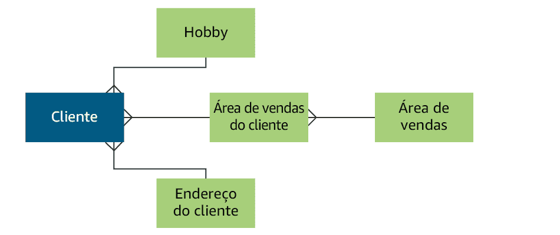

# Consistência e integridade de dados

## Esquema de dados

* **Definição:** um esquema de dados é o conjunto de metadados usado pelo banco de dados para organizar objetos de dados e impor restrições de integridade.
* **Tipos:** existem dois tipos de esquemas: lógico e físico.
* **Esquema lógico:** define as restrições a serem aplicadas aos dados no banco de dados.
* **Esquema físico:** define a organização física dos dados no banco de dados.

## Limpeza de dados

* **Limpeza de dados:** é o processo de detecção e correção de corrupções nos dados.
* **Tipos de integridade de dados:**
    * **Integridade referencial:** garante que as restrições das relações da tabela sejam impostas.
    * **Integridade do domínio:** garante que os dados inseridos em um campo correspondam ao tipo de dados definido para esse campo.
    * **Integridade da entidade:** garante que os valores armazenados em um campo correspondam às restrições definidas para esse campo.
* **Como limpar dados:**
    * **Saiba qual deve ser a limpeza:** antes de fazer qualquer outra coisa, você deve ter consenso sobre o resultado limpo.
    * **Rastreie a origem dos erros:** isso ajudará a prever cargas de trabalho que terão problemas de integridade.
    * **Considere o impacto das alterações:** inserir um zero em uma coluna vazia pode parecer uma decisão de limpeza de dados fácil, mas é preciso saber quais os efeitos dessa alteração.
    * **Mantenha os dados originais:** em alguns casos, é importante manter os dados originais e os dados transformados.

## ACID

* **Definição:** ACID é um acrônimo para Atomicidade, Consistência, Isolamento e Durabilidade. É um método para manter a consistência e a integridade em um banco de dados estruturado.
* **Atomicidade:** garante que suas transações sejam bem-sucedidas por completo ou falhem por completo.
* **Consistência:** garante que todas as transações forneçam dados válidos para o banco de dados.
* **Isolamento:** garante que uma transação não possa interferir em outra transação simultânea.
* **Durabilidade:** garante que as alterações de dados realmente se mantenham.

## BASE

* **Definição:** BASE é um acrônimo para BAsicamente disponível, eStado flexível, Eventualmente consistente. É um método para manter a consistência e a integridade em um banco de dados estruturado ou semiestruturado.
* **BA:** permite que uma instância receba uma solicitação de alteração e disponibilize essa alteração imediatamente.
* **Estado flexível:** há tolerâncias para consistência parcial entre instâncias distribuídas.
* **Consistência eventual:** os dados estarão eventualmente consistentes.

## Comparação entre ACID e BASE

| Característica | ACID | BASE |
|---|---|---|
| Consistência | Forte | Fraca |
| Isolamento | Forte | Fraco |
| Disponibilidade | Alta | Baixa |
| Aplicação | Bancos de dados estruturados | Bancos de dados semiestruturados |

## Conclusão

A consistência e a integridade de dados são essenciais para garantir a confiabilidade e a precisão dos dados. Existem diferentes métodos para garantir a consistência e a integridade de dados, cada um com seus próprios prós e contras.


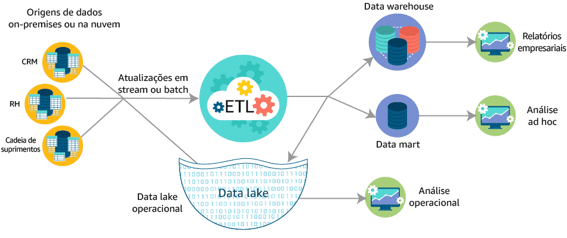

# ETL

## **Por que fazer o processo de ETL?**

O processo de ETL é importante para garantir a qualidade, a confiabilidade e a integridade dos dados. Ele permite que você:

* **Garanta que os dados tenham a exatidão, a precisão e a profundidade necessárias.** O processo de ETL pode ajudar a identificar e corrigir erros nos dados, além de padronizar os dados para que eles possam ser usados de forma eficaz por diferentes sistemas e aplicativos.
* **Reúna dados de diferentes fontes e tenha uma visão completa.** O processo de ETL pode ajudar a combinar dados de diferentes sistemas e aplicativos para criar uma visão abrangente de um negócio ou processo.
* **Crie conjuntos de dados específicos com a finalidade de responder às principais perguntas de negócios.** O processo de ETL pode ajudar a criar conjuntos de dados personalizados para atender às necessidades específicas de análise de negócios.

## **Transformação de dados - comparação entre o Amazon EMR e o AWS Glue**

O Amazon EMR e o AWS Glue são duas opções para executar o componente de transformação de dados do ETL na AWS. Ambos os serviços fornecem resultados semelhantes, mas exigem diferentes quantidades de conhecimento e investimento de tempo.

## **Amazon EMR**

O Amazon EMR é uma plataforma de processamento de dados em cluster gerenciada que fornece uma infraestrutura completa para executar tarefas de ETL. Ele é uma boa opção para organizações que precisam de flexibilidade e controle sobre seu pipeline de ETL.

## **Vantagens:**

* **Flexibilidade:** Você pode personalizar seu pipeline de ETL para atender às suas necessidades específicas.
* **Controle:** Você tem controle sobre a infraestrutura e os recursos usados para executar seu pipeline de ETL.

**Desvantagens:**

* **Requer conhecimento técnico:** É necessário ter conhecimento técnico para configurar e gerenciar um cluster do Amazon EMR.
* **Pode ser caro:** Os custos de infraestrutura podem ser altos, especialmente para cargas de trabalho de ETL complexas.

## **AWS Glue**

O AWS Glue é uma ferramenta de ETL gerenciada sem servidor que oferece uma experiência muito mais simplificada do que o Amazon EMR. Ele é uma boa opção para organizações que precisam de uma solução de ETL de baixo custo e fácil de usar.

**Vantagens:**

* **Simplicidade:** O AWS Glue é uma ferramenta de ETL sem servidor que é fácil de configurar e usar.
* **Custo-efetividade:** O AWS Glue é uma solução de ETL de baixo custo.

## **Desvantagens:**

* **Menos flexibilidade:** O AWS Glue oferece menos flexibilidade do que o Amazon EMR.
* **Menos controle:** Você tem menos controle sobre a infraestrutura e os recursos usados para executar seu pipeline de ETL.

## **Conclusão**

A escolha entre o Amazon EMR e o AWS Glue depende das necessidades específicas da sua organização. Se você precisa de flexibilidade e controle, o Amazon EMR é a melhor opção. Se você precisa de uma solução de ETL de baixo custo e fácil de usar, o AWS Glue é a melhor opção.
# Valor

Análise de informações é o processo de análise de informações para encontrar o valor contido nelas. Esse termo geralmente é sinônimo de análise de dados.

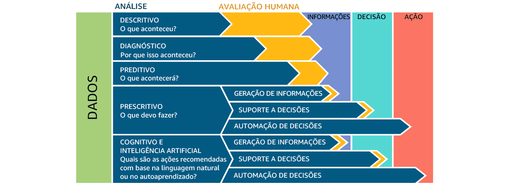

## Previsões em Tempo Real

* **Amazon Kinesis Data Analytics:** Este serviço é usado para coletar dados do aplicativo e enviá-los para o Amazon ML.
* **Amazon ML:** Este serviço é usado para treinar e avaliar modelos de machine learning.
* **Amazon SageMaker:** Este serviço é usado para implantar modelos de machine learning em produção.
* **Amazon API Gateway:** Este serviço é usado para expor as previsões do Amazon ML para os usuários do aplicativo.

##  Processo de previsão funciona da seguinte forma:

1. Os dados do aplicativo são coletados pelo Amazon Kinesis Data Analytics.
2. Os dados são enviados para o Amazon ML, que os usa para treinar um modelo de machine learning.
3. O modelo de machine learning é implantado no Amazon SageMaker.
4. As previsões são feitas pelo Amazon SageMaker e enviadas para o Amazon API Gateway.
5. Os usuários do aplicativo podem acessar as previsões por meio do Amazon API Gateway.

Essa arquitetura permite que os desenvolvedores produzam previsões em tempo real para seus usuários sem precisar se preocupar com a complexidade da criação e implantação de um modelo de machine learning.

## Serviços usados nessa arquitetura:

**Amazon Kinesis Data Analytics:** O Amazon Kinesis Data Analytics é um serviço de streaming de dados que permite coletar, processar e analisar grandes volumes de dados em tempo real. Ele é usado para coletar dados do aplicativo e enviá-los para o Amazon ML.

**Amazon ML:** O Amazon ML é um serviço de machine learning que permite treinar, avaliar e implantar modelos de machine learning. Ele é usado para treinar e avaliar um modelo de machine learning para prever as necessidades dos usuários do aplicativo.

**Amazon SageMaker:** O Amazon SageMaker é um serviço de machine learning que permite criar, treinar e implantar modelos de machine learning de forma rápida e fácil. Ele é usado para implantar o modelo de machine learning treinado no Amazon ML em produção.

**Amazon API Gateway:** O Amazon API Gateway é um serviço de API que permite expor APIs de back-end para aplicativos e serviços. Ele é usado para expor as previsões do Amazon ML para os usuários do aplicativo.

Essa arquitetura é apenas um exemplo de como o Amazon ML pode ser usado para produzir previsões em tempo real. Os desenvolvedores podem personalizar essa arquitetura para atender às suas necessidades específicas.


**Arquitetura para previsões em tempo real**

* **Amazon DynamoDB:** Armazena os dados do aplicativo
* **AWS Data Pipeline:** Orquestra o fluxo de dados e a preparação para uso no Amazon SageMaker
* **Amazon SageMaker:** Treina e implanta modelos de machine learning

**Análise cognitiva**

* A análise cognitiva usa machine learning para fornecer recomendações altamente especializadas sem envolvimento humano.
* Exemplos de análise cognitiva incluem:
    * Recomendações de investimento
    * Recomendações de saúde
    * Diagnóstico veterinário
    * Gerenciamento de equipes esportivas

## **Serviços analíticos e velocidade**

* A análise em batch geralmente envolve consulta a grandes quantidades de dados “frios”.
* A análise em tempo real geralmente envolve consulta a pequenos conjuntos de dados “quentes”.
* Os sistemas de análise em batch são mais rápidos que os sistemas de análise em tempo real.
* Os sistemas de análise em tempo real são mais flexíveis que os sistemas de análise em batch.

## **Observações**

* Vários sistemas e plataformas podem ser empilhados ou combinados entre si.
* A maioria dos data warehouses tem algum suporte para análise em batch.

## **Comentários**

A arquitetura para previsões em tempo real é uma maneira eficaz de fornecer recomendações personalizadas aos usuários. A análise cognitiva é uma área de crescimento rápido que oferece oportunidades significativas para empresas. É importante entender as diferenças entre análise em batch e análise em tempo real para escolher a abordagem certa para sua carga de trabalho.

Aqui estão algumas perguntas adicionais que você pode considerar:

* Quais são os requisitos específicos para sua arquitetura de previsões em tempo real?
* Como você pode garantir a qualidade dos dados usados para treinar seus modelos de machine learning?
* Como você gerenciará o ciclo de vida dos seus modelos de machine learning?
* Como você garantirá a segurança de seus dados?

Ao responder a essas perguntas, você poderá criar uma arquitetura de previsões em tempo real que atenda às suas necessidades específicas.

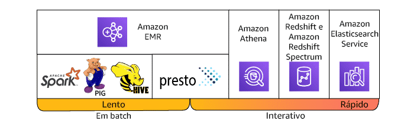

## **Análise interativa**

* A análise interativa envolve a execução de consultas intrincadas em conjuntos de dados complexos em altas velocidades.
* A análise interativa permite que os usuários consultem e vejam os resultados imediatamente.
* A análise em batch geralmente é executada em segundo plano, fornecendo avaliação em formato de relatórios entregues de forma programada.

## **Serviços de análise interativa da AWS**

* **Amazon Athena:** Facilita a avaliação de dados diretamente no Amazon S3 e no Amazon S3 Glacier usando consultas SQL padrão.
* **Amazon ES:** Permite pesquisar, explorar, filtrar, agregar e visualizar seus dados quase em tempo real.
* **Amazon Redshift:** Oferece a capacidade de executar consultas complexas e análises em petabytes de dados estruturados e inclui o Redshift Spectrum, que executa consultas SQL diretamente em exabytes de dados estruturados ou não estruturados no Amazon S3 sem precisar mover dados de forma desnecessária.

## **Comentários**

A análise interativa é importante para empresas que precisam analisar dados rapidamente para tomar decisões informadas. Os serviços de análise interativa da AWS oferecem uma variedade de opções para atender às diferentes necessidades das empresas.

Aqui estão algumas perguntas adicionais que você pode considerar:

* Quais são os requisitos específicos para sua análise interativa?
* Quais tipos de dados você precisa analisar?
* Qual é o volume de dados que você precisa analisar?
* Qual é o tempo de resposta necessário para suas análises?

Ao responder a essas perguntas, você poderá escolher o serviço de análise interativa da AWS certo para sua organização.


# Análise em stream

A análise em stream é um processo de ingestão de uma sequência de dados e a atualização incremental de métricas, relatórios e estatísticas de resumo em resposta a cada registro de dados recebido. Esse método é mais adequado para funções de monitoramento e resposta em tempo real.

# Processamento de dados de streaming

O processamento de dados de streaming requer duas camadas: uma camada de armazenamento e uma camada de processamento.

* **Camada de armazenamento:** responsável por armazenar os dados de streaming de forma que possam ser acessados e processados rapidamente.
* **Camada de processamento:** responsável por consumir os dados da camada de armazenamento, realizando cálculos sobre esses dados e, em seguida, enviando notificações para a camada de armazenamento excluir os dados que não são mais necessários.

# Plataformas de dados de streaming

Existem várias plataformas que oferecem a infraestrutura necessária para criar aplicativos de dados de streaming, incluindo:

* **Amazon Kinesis:** uma plataforma para dados de streaming na AWS, oferecendo serviços avançados para facilitar o carregamento e a análise de dados de streaming.
* **Apache Kafka:** um sistema de streaming de dados de código aberto, amplamente usado para aplicações de streaming de dados em tempo real.
* **Apache Flume:** um sistema de coleta de dados de código aberto, usado para coletar dados de fontes heterogêneas e transmiti-los para um sistema de armazenamento ou processamento de dados.
* **Apache Spark Streaming:** um framework de processamento de dados de streaming, usado para processar dados de streaming em tempo real ou batch.
* **Apache Storm:** um sistema de processamento de streaming de código aberto, usado para processar dados de streaming em tempo real.

# Amazon Kinesis

O Amazon Kinesis é uma plataforma para dados de streaming na AWS, oferecendo serviços avançados para facilitar o carregamento e a análise de dados de streaming. O Kinesis oferece dois serviços:

* **Amazon Kinesis Data Firehose:** um serviço de streaming de dados de alto desempenho, usado para coletar, processar e enviar dados de streaming para o Amazon S3, o Amazon Redshift ou o Amazon Elasticsearch Service.
* **Amazon Kinesis Data Streams:** um serviço de streaming de dados de baixo custo, usado para armazenar e processar dados de streaming em tempo real.

# Pré-processamento de dados de streaming

Se os dados no fluxo precisarem de conversão de formato, transformação, enriquecimento ou filtragem, você poderá pré-processar os dados usando uma função do AWS Lambda. Você pode fazer isso antes que o código SQL do aplicativo seja executado ou antes que o aplicativo crie um esquema do seu stream de dados.

# Implantação de plataformas de dados de streaming

Você pode instalar plataformas de dados de streaming de sua escolha no Amazon Elastic Compute Cloud (Amazon EC2) e no Amazon EMR e criar suas próprias camadas de armazenamento e processamento em stream.

* **Amazon EC2:** serviço de computação em nuvem da AWS, usado para provisionar máquinas virtuais.
* **Amazon EMR:** serviço de processamento de big data em nuvem da AWS, usado para executar aplicativos de big data no Hadoop e no Spark.

# Conclusão

A análise em stream é uma ferramenta poderosa para monitoramento e resposta em tempo real. Ao escolher uma plataforma de dados de streaming, é importante considerar as necessidades específicas do seu aplicativo.


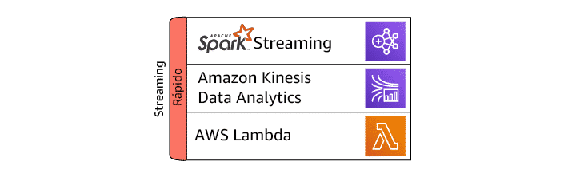


 # Pipeline de análise de dados

A análise de dados é o processo de coleta, limpeza, transformação e análise de dados para obter insights.

## **Coletar dados**

Os dados podem ser coletados de duas maneiras:

* **Em batches grandes:** os dados são coletados em um único momento e armazenados em um local central.
* **Em um processo de stream:** os dados são coletados continuamente e armazenados em um fluxo.

## **Armazenar dados**

Os dados podem ser armazenados de duas maneiras:

* **Armazenamento de objetos:** os dados são armazenados como arquivos individuais.
* **Armazenamento de registros:** os dados são armazenados em tabelas.

## **Processar e analisar dados**

Os dados são processados e analisados em vários estágios diferentes, sendo um processo iterativo.

* **Pré-processamento:** os dados são limpos e transformados para serem compatíveis com o armazenamento e análise de dados.
* **Processamento e análise:** os dados são processados e analisados para obter insights.

## **Consumir e visualizar dados**

Os dados podem ser consumidos e visualizados de diversas maneiras, usando uma grande variedade de ferramentas.

* **Visualização de dados:** os dados são representados graficamente para facilitar a compreensão.
* **Avaliação:** os dados são usados para responder a perguntas sobre os negócios.

## **Tipos de relatórios**

Os relatórios analíticos são apresentados em vários formatos e tamanhos diferentes.

* **Relatórios estáticos:** são relatórios prontos para uso que não podem ser alterados.
* **Relatórios interativos:** são relatórios que podem ser personalizados pelo usuário.
* **Painéis:** são conjuntos de gráficos e tabelas que fornecem uma visão geral dos dados.

## **O Amazon QuickSight**

O Amazon QuickSight é um serviço analítico de negócios que permite que os usuários criem relatórios e painéis interativos.

## **Categorias de relatórios**

As categorias abrangentes de relatórios são estático, interativo e painel. Em tempo real é uma velocidade de recuperação de dados, mas não um tipo de relatório.

## **Exemplos de perguntas de avaliação**

* **Descritiva:** Quais foram as vendas totais em abril?
* **Diagnóstica:** Quais são as vendas totais do ano a ano para a região Ásia-Pacífico?
* **Preditiva:** Qual é o crescimento projetado para internações relacionadas a tabagismo no próximo ano?
* **Prescritiva:** Quais produtos devo comprar se gosto do time Seattle Seahawks?
* **Cognitiva:** Qual é o número médio de veículos detectados pela minha campainha de vídeo?

## **Preparação de dados**

A preparação de dados é o processo de garantir que os dados estejam limpos, consistentes e no formato correto para análise.

* **Exploração de dados:** examinar os dados para identificar problemas potenciais.
* **Limpeza de dados:** corrigir erros e inconsistências nos dados.
* **Transformação de dados:** converter os dados para o formato correto para análise.

## **Visualização de dados**

A visualização de dados é o processo de representar dados graficamente para facilitar a compreensão.

* **Escolha do gráfico correto:** use o gráfico certo para o tipo de dados que você está visualizando.
* **Uso de legendas e títulos:** forneça legendas e títulos claros para que os usuários possam entender o que estão vendo.
* **Formatação de dados:** formate os dados de forma consistente para facilitar a comparação.

## Serviços e produtos

* **Amazon Redshift:** serviço de data warehouse da AWS utilizado para modernizar data warehouses herdados
* **Amazon Kinesis:** produto da AWS você usado para dados em transmissão


## Categorias relacionadas a dados e análises na AWS

* **Governança e segurança de dados:** implementação de práticas de governança de dados e segurança para proteger e gerenciar os dados da organização
* **Integração e preparação dos dados:** atividades de integração de dados e preparação para análises, incluindo coleta, transformação e disponibilização de dados para análises
* **Business Intelligence (BI) e visualização de dados:** uso de ferramentas de BI e visualização para criar painéis e relatórios que auxiliam na tomada de decisões com base nos dados


## Software de código aberto de análise de dados compatíveis com a AWS

* **Amazon EMR para Hadoop:** plataforma da AWS para processamento de big data que é compatível com várias estruturas de código aberto, incluindo o ecossistema Hadoop
* **Amazon Elasticsearch Service for Elasticsearch:** serviço gerenciado que permite implantar e escalar o Elasticsearch, que é uma plataforma de busca e análise de código aberto
* **AWS Glue:** serviço de ETL (Extração, Transformação e Carga) totalmente gerenciado que é usado para a preparação de dados para análises


## Outros conceitos e termos

* **AWS Service Delivery Program:** programa da AWS que ajuda os clientes a encontrar parceiros confiáveis e qualificados para serviços específicos da AWS
* **Nível "Select":** status de especialização do APN (AWS Partner Network) Navigate que os parceiros de consultoria da AWS começam a alcançar
* **Data lake descaracterizado (DIDL):** parte importante de uma solução de governança de dados que ajuda a resolver problemas de PII (Informação Pessoalmente Identificável) e auxilia no cumprimento das regulamentações de privacidade
* **Componentes típicos de um pipeline de dados:** coleta, armazenamento, processamento e análise, visualização
* **PartnerCast:** série semanal de webinars interativos gratuitos sobre produtos e serviços da AWS projetados para ajudar os parceiros a desenvolver novas oportunidades para os clientes e aprimorar relacionamentos profissionais
* **Criar um data lake:** primeira etapa de uma jornada do cliente para se tornar uma empresa orientada por dados


## Diferenciais de análise de dados da AWS

* **Inovação:** ampla gama de serviços e ferramentas para análise de dados, permitindo que as organizações inovem e desenvolvam soluções de análise avançadas
* **Economia de custo:** evitar custos de infraestrutura significativos e pagar apenas pelo que usa
* **Agilidade empresarial:** escalabilidade e flexibilidade, permitindo que as empresas ajustem e expandam suas operações de análise conforme necessário


## Outros termos específicos

* **Detratores:** função que tem interesse em manter os parâmetros atuais devido a preocupações sobre empregos, perda de autoridade e desinformação sobre os benefícios das ofertas em nuvem
* **Framework de perguntas de descoberta:** geralmente inclui as seguintes áreas principais: vantagens competitivas, impacto e desafios
* **Data lake:** abordagem arquitetônica para um repositório corporativo centralizado que pode armazenar dados estruturados, não estruturados, semiestruturados e brutos
* **Promotores:** função que tem experiência de campo com os clientes e pode influenciar os influenciadores
* **Amazon S3:** armazenamento de objetos durável e disponível, altamente escalável e econômico
* **Data warehouse:** repositório central de dados selecionados de diferentes fontes usado para relatórios de dados, análises e tomada de decisão informada
* **Influenciadores:** função que normalmente não tem autoridade de tomada de decisão, mas pode influenciar as decisões de um executivo de nível C


# Exploração do pipeline de análise

Um pipeline de análise consiste em um conjunto de estágios específicos. Cada estágio tem um propósito exclusivo na arquitetura geral:

1. **Ingestão:** Este estágio coleta os dados brutos de telemetria gerados pelo jogo e pelas aplicações associadas.
2. **Armazenamento:** Este estágio armazena os dados ingeridos em um repositório central.
3. **Processamento/análise:** Este estágio processa e analisa os dados armazenados para gerar insights.
4. **Consumo:** Este estágio fornece aos usuários acesso aos insights gerados.

A imagem abaixo mostra um pipeline de análise genérico. Ele começa com dados brutos de telemetria gerados pelo jogo e pelas aplicações associadas. Conforme descrito nas lições anteriores, este pode ser um evento que representa a compra de um item no jogo feita por um jogador. Ele também pode representar ações específicas de jogabilidade, como um jogador interagindo com uma parte específica do mapa. Esses cenários geram dados brutos que podem ser ingeridos no pipeline de análise e transformados em respostas.

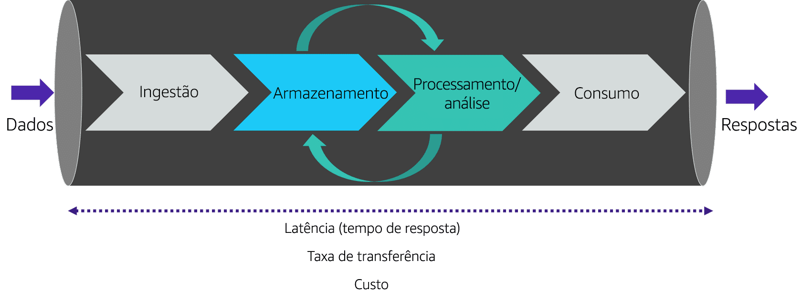

**Ingestão**

O estágio de ingestão é responsável por coletar os dados brutos de telemetria gerados pelo jogo e pelas aplicações associadas. Esses dados podem ser coletados de várias fontes, como:

* **Logs de servidor:** Os logs de servidor contêm informações sobre as ações dos jogadores, como o início de uma sessão de jogo, a compra de um item ou a interação com um inimigo.
* **Dados de sensores:** Os dados de sensores podem ser usados para rastrear o comportamento do jogador, como a localização do jogador no mapa ou o uso de um controle específico.
* **Dados de terceiros:** Os dados de terceiros podem ser usados para fornecer contexto adicional sobre os dados de telemetria, como dados demográficos do jogador ou informações sobre o jogo.

**Armazenamento**

O estágio de armazenamento é responsável por armazenar os dados ingeridos em um repositório central. O repositório de armazenamento deve ser capaz de armazenar grandes quantidades de dados de forma eficiente e segura.

**Processamento/análise**

O estágio de processamento/análise é responsável por processar e analisar os dados armazenados para gerar insights. Esse estágio pode envolver as seguintes atividades:

* **Limpeza de dados:** Os dados podem precisar ser limpos para remover erros ou inconsistências.
* **Transformação de dados:** Os dados podem precisar ser transformados para que possam ser analisados.
* **Análise de dados:** Os dados podem ser analisados para identificar padrões e tendências.

**Consumo**

O estágio de consumo é responsável por fornecer aos usuários acesso aos insights gerados. Os insights podem ser consumidos por meio de ferramentas de BI, relatórios ou painéis.

**Exemplo de pipeline de análise para um jogo**

Aqui está um exemplo de pipeline de análise para um jogo:

1. **Ingestão:** Os dados brutos de telemetria são coletados de logs de servidor, dados de sensores e dados de terceiros.
2. **Armazenamento:** Os dados ingeridos são armazenados em um data warehouse.
3. **Processamento/análise:** Os dados armazenados são processados e analisados para identificar padrões e tendências de jogo.
4. **Consumo:** Os insights gerados são consumidos por jogadores, desenvolvedores e gerentes de jogo.

**Considerações de design**

Ao projetar um pipeline de análise, é importante considerar os seguintes fatores:

* **Volume de dados:** O pipeline deve ser capaz de lidar com grandes quantidades de dados de telemetria.
* **Velocidade de dados:** O pipeline deve ser capaz de processar dados de forma rápida para que os insights sejam gerados em tempo hábil.
* **Requisitos de segurança:** O pipeline deve proteger os dados contra acesso não autorizado.
* **Custo:** O pipeline deve ser viável do ponto de vista econômico.

Ao considerar esses fatores, você pode projetar um pipeline de análise que atenda às necessidades específicas do seu jogo.


# Considerações de arquitetura técnica para pipelines de análise de jogos

Ao desenvolver um pipeline de análise, é importante considerar os prós e os contras de cada arquitetura técnica para tomar decisões informadas sobre o design do sistema.

**Latência**

A latência é o tempo que leva para um sistema responder a uma solicitação. Em um pipeline de análise, a latência é importante porque afeta a rapidez com que os insights podem ser gerados e usados.

* **Prós:**
    * Melhor experiência do usuário
    * Melhor desempenho
    * Melhor escalabilidade
* **Contras:**
    * Maior custo
    * Menor escalabilidade

**Taxa de transferência**

A taxa de transferência é a quantidade de dados que um sistema pode processar por unidade de tempo. Em um pipeline de análise, a taxa de transferência é importante porque afeta a rapidez com que os dados podem ser processados e analisados.

* **Prós:**
    * Maior taxa de transferência
    * Melhor desempenho
    * Maior escalabilidade
* **Contras:**
    * Maior custo
    * Menor latência

**Custo**

O custo é sempre um fator a ser considerado ao desenvolver um pipeline de análise. O custo pode incluir o custo de hardware, software, manutenção e pessoal.

* **Prós:**
    * Menor custo
    * Maior eficiência
* **Contras:**
    * Menor desempenho
    * Menor confiabilidade

**Dicas para escolher a arquitetura técnica certa:**

* **Defina suas necessidades:** O que você precisa que seu pipeline de análise faça? Quais são seus requisitos de latência, taxa de transferência e custo?
* **Considere as opções:** Pesquise as diferentes arquiteturas técnicas disponíveis e considere como elas atenderiam às suas necessidades.
* **Faça testes:** Experimente diferentes arquiteturas técnicas para ver qual delas atende melhor às suas necessidades.

Ao seguir essas dicas, você pode escolher a arquitetura técnica certa para o seu jogo e garantir que ele esteja obtendo os insights necessários para melhorar a experiência do jogador.

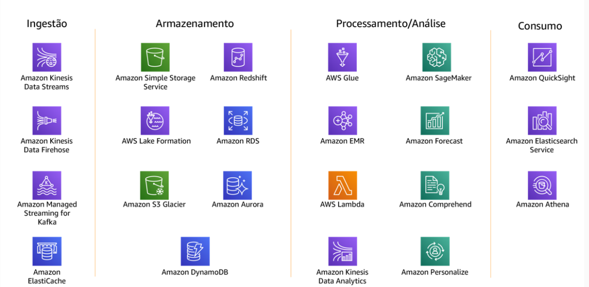

## Processo de Gerenciamento de Dados

- **Processamento/Análise:** Nesta etapa, os dados brutos são limpos e organizados em tabelas de dados.

- **Ingestão:** É quando os serviços coletam dados de várias fontes.

- **Armazenamento:** Os dados são armazenados em repositórios durante esta fase.

- **Processamento/Análise:** Os serviços manipulam os dados nos formatos necessários.

- **Consumo:** Nesta fase, os dados são apresentados nos formatos exigidos.

## Dicas para Gerenciamento de Recursos

1. **Identificação de Requisitos:** Identifique os requisitos dos recursos.

2. **Avaliação da Sobrecarga Operacional:** Avalie a sobrecarga operacional.

3. **Orçamento:** Considere cuidadosamente o orçamento da solução.

4. **Habilidades:** Identifique lacunas de habilidades e compense com treinamento.

5. **Requisitos vs. Recursos:** Avalie seus requisitos em relação aos recursos de soluções predefinidas e personalizadas.

6. **Serviços na Nuvem:** Considere os serviços baseados em nuvem para reduzir a sobrecarga de gerenciamento da infraestrutura.

7. **Escalabilidade de Custos:** Entenda como seus custos serão escalados à medida que o uso cresce.

8. **Tecnologias Amplamente Utilizadas:** Considere a adoção de tecnologias amplamente usadas em diferentes tipos de funções.

## **Conclusão**

A análise de dados é uma ferramenta poderosa que pode ser usada para tomar decisões informadas. Ao entender os diferentes componentes do pipeline de análise de dados, você pode usar essa ferramenta para obter insights valiosos sobre seus negócios.
