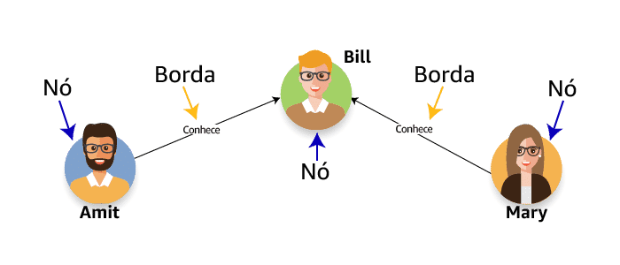

# Crescimento Exponencial de Dados de Negócios

Há três classificações amplas de tipos de origem dos dados:

| Tipo de Dado       | Descrição                                             |
|---------------------|-------------------------------------------------------|
| Dados Estruturados  | Organizados em linhas e colunas de uma tabela.       |
| Dados Semiestruturados | Armazenados em conjuntos de pares de chave-valor. |
| Dados Não Estruturados | Não têm uma estrutura consistente.               |

Na AWS, o Amazon Simple Storage Service (Amazon S3) é o melhor lugar para armazenar todos os seus dados semiestruturados e não estruturados.

## Amazon Simple Storage Service (Amazon S3)

Amazon S3 é um serviço de armazenamento da AWS que permite armazenar objetos. Um objeto é composto por um arquivo e quaisquer metadados que descrevam esse arquivo. Para armazenar um objeto no Amazon S3, você faz o upload do arquivo que deseja armazenar no bucket. Ao fazer o upload de um arquivo, você pode definir permissões no objeto e adicionar metadados.

Buckets são contêineres lógicos para objetos. Você pode ter um ou mais buckets em sua conta e controlar o acesso a cada um individualmente. Você controla quem pode criar, excluir e listar objetos no bucket. Você também pode visualizar logs de acesso do bucket e seus objetos e escolher a região geográfica onde o Amazon S3 armazenará o bucket e o respectivo conteúdo.

Exemplo de URL para um objeto em um bucket chamado "doc" com a chave de objeto "2006-03-01/AmazonS3.html":

Uma chave de objeto é um identificador exclusivo de um objeto em um bucket. Como a combinação de um bucket, chave e ID de versão identifica exclusivamente cada objeto, você pode considerar o Amazon S3 como um mapa de dados básico entre "bucket + chave + versão" e o próprio objeto.

## Data Lakes e Data Warehouses

Um data lake é um repositório centralizado que permite armazenar dados estruturados, semiestruturados e não estruturados em qualquer escala.

Um data warehouse, por outro lado, é um repositório central de dados estruturados de várias origens. Os dados são transformados, agregados e preparados para relatórios e análises de negócios.

### Data Marts

Para facilitar a análise, as organizações muitas vezes criam data marts, que são subconjuntos de dados de um data warehouse. Os data marts se concentram em um único assunto ou área funcional, permitindo análises mais específicas.

## Armazenamento de Dados em Grande Escala

- Ao armazenar objetos individuais, recomenda-se o uso do Amazon S3.
- Para volumes massivos de dados semiestruturados e não estruturados, crie um data lake no Amazon S3.
- Para dados estruturados para análises complexas, armazene dados no Amazon Redshift.

## Apache Hadoop

O Apache Hadoop é um framework que facilita a análise de grandes quantidades de dados. Diferente dos sistemas tradicionais de bancos de dados, o Hadoop pode processar dados estruturados, semiestruturados ou não estruturados.

O Hadoop usa uma arquitetura de processamento distribuído, o que permite a rápida análise de grandes volumes de dados.

### Implementação do Hadoop com o Amazon EMR

O Amazon EMR é o serviço AWS que implementa frameworks Hadoop. Ele permite a ingestão de dados de várias origens e armazena esses dados em um sistema de arquivos temporário, que pode ser o HDFS ou o EMRFS. Em seguida, a transformação e a análise dos dados são realizadas.

O Amazon EMRFS oferece uma alternativa ao HDFS, melhorando o desempenho ao eliminar a etapa de cópia de dados.

## Conclusão

Os data lakes e data warehouses têm suas próprias vantagens e são adequados para diferentes tipos de dados. A AWS fornece uma variedade de serviços para lidar com o armazenamento e processamento de dados em grande escala.

# Velocidade

Quando as empresas precisam de informações rápidas dos dados que estão coletando, mas os sistemas implantados simplesmente não conseguem atender às necessidades, há um problema de velocidadeDefinição

O processamento de dados significa a coleta e a manipulação de dados para produzir informações significativas. A coleta de dados é dividida em duas partes: coleta de dados e processamento de dados.

Em batch: a velocidade é muito previsível no processamento em batch. Isso equivale a altos picos de transferência de dados em intervalos programados.

Periódico: a velocidade é menos previsível no processamento periódico. A perda de eventos programados pode sobrecarregar os sistemas e deve ser considerada.

Quase em tempo real: a velocidade é uma grande preocupação no processamento quase em tempo real. Esses sistemas exigem que os dados sejam processados em minutos após a coleta inicial dos dados. Isso pode sobrecarregar bastante os sistemas de processamento e análise envolvidos.

Em tempo real: a velocidade é a maior preocupação para sistemas de processamento em tempo real. As informações não podem levar minutos para serem processadas. Elas devem ser processadas em segundos para serem válidas e manterem sua utilidade.

Aceleração de dados

Outra característica principal da velocidade dos dados é a aceleração de dados, o que significa a taxa na qual grandes coleções de dados podem ser ingeridas, processadas e analisadas. A aceleração de dados não é constante, ela vem em picos. Considere o Twitter como exemplo. Hashtags podem se tornar imensamente populares e aparecer centenas de vezes em apenas segundos, ou diminuir a velocidade para uma tag por hora. Isso é a aceleração de dados em ação. Seu sistema deve conseguir lidar de forma eficiente com o pico de centenas de tags por segundo e com a baixa demanda de uma tag por hora.

Atributos do processamento em batch e em stream

A tabela a seguir destaca a diferença entre o processamento em batch e o processamento em stream:

Processamento em batch: processa grandes quantidades de dados de uma só vez. Isso requer um sistema que possa coletar e armazenar esses dados até que o sistema de processamento possa lidar com tudo isso.

Processamento periódico: processa cargas de trabalho irregulares imprevisíveis. A impossibilidade de prever essas cargas de trabalho sobrecarrega os sistemas de big data.

Processamento quase em tempo real: processa pequenos picos de dados que devem ser coletados e processados em minutos após a coleta.

Processamento em tempo real: processa pequenos picos de dados continuamente. Esses dados devem ser apresentados à fase de análise em instantes após a coleta.

O processamento em batch é a execução de uma série de programas ou trabalhos em um ou mais computadores sem intervenção manual. Os dados são coletados em batches de maneira assíncrona. O batch é enviado a um sistema de processamento quando condições específicas são atendidas, como um horário específico do dia. Os resultados do trabalho de processamento são enviados a um local de armazenamento que pode ser consultado posteriormente, conforme necessário.

Processamento de dados em batch com o Amazon EMR e o Apache Hadoop

O Amazon EMR é um serviço gerenciado para a implantação de cargas de trabalho do Apache Hadoop. Além de executar o framework Apache Hadoop, você também pode executar outros frameworks distribuídos conhecidos, como Apache Spark, HBase, Presto e Flink no EMR. Você tem a vantagem adicional de poder interagir com dados em outros datastores da AWS, como o Amazon S3 e o Amazon DynamoDB.

Os Amazon EMR notebooks oferecem um ambiente de desenvolvimento e colaboração sem servidor para consultas únicas e avaliaçãos exploratórias. Você pode manipular os dados e gerar gráficos de dados usando ferramentas gráficas avançadas. Os Amazon EMR notebooks monitoram seus trabalhos e até ajudam você a depurar o código dos notebooks.

Exploração do Apache Hadoop

O Apache Hadoop é um sistema escalável de armazenamento e processamento de dados em batch. Ele usa hardware de servidor de commodity e fornece tolerância a falhas por meio de software. O Hadoop complementa os sistemas de dados existentes ao ingerir e processar simultaneamente grandes volumes de dados, estruturados ou não, de qualquer quantidade de fontes, o que permite uma avaliação mais profunda do que qualquer outro sistema pode oferecer. Esses resultados podem ser entregues a qualquer sistema empresarial existente para uso adicional, independentemente do Hadoop.

O Hadoop é uma plataforma que fornece módulos distintos.

O Hadoop Common é o conjunto de utilitários e bibliotecas Java que oferecem suporte a outros módulos do Hadoop. Essas bibliotecas ajudam a abstrair o sistema de arquivos dos componentes de processamento. Esses arquivos e scripts Java são necessários para iniciar o Hadoop.

O Hadoop Distributed File System (HDFS) é o sistema de arquivos distribuídos que armazena os dados em um ambiente de alta taxa de transferência de nós da comunidade. Essa arquitetura garante acesso aos dados do aplicativo com largura de banda agregada alta.

O Hadoop YARN é o framework de gerenciamento de recursos responsável por programar e executar trabalhos de processamento.

O Hadoop MapReduce é um sistema baseado em YARN que permite o processamento paralelo de grandes conjuntos de dados no cluster.

O processamento em batch pode ser feito de diferentes maneiras usando os serviços AWS

O diagrama de arquitetura abaixo descreve os componentes e o fluxo de dados de um sistema analítico básico de batches usando uma abordagem tradicional. Essa abordagem usa o Amazon S3 para armazenar dados, o AWS Lambda para ETL intermediário em nível de arquivo, o Amazon EMR para ETL agregado (trabalho pesado, transformação consolidada e mecanismo de carregamento) e o Amazon Redshift como hospedagem de dados em data warehouse necessários para geração de relatórios.

O diagrama de arquitetura abaixo descreve o mesmo fluxo de dados acima, mas usa o AWS Glue para ETL agregado (trabalho pesado, transformação consolidada e mecanismo de carregamento). O AWS Glue é um serviço totalmente gerenciado, ao contrário do Amazon EMR, que requer gerenciamento e configuração de todos os componentes do serviço.

Análise de logs
O Amazon EMR pode ser usado para processar logs gerados por aplicativos móveis e da web. O serviço ajuda os clientes a transformar petabytes de dados não estruturados ou semiestruturados em informações úteis sobre seus aplicativos ou usuários. Nesses casos de uso, os logs geralmente são coletados em batches e agregados e analisados no final do dia para obter informações significativas.

Visualização unificada de dados entre múltiplos datastores
É possível usar o AWS Glue Data Catalog para descobrir e fazer pesquisas rapidamente em vários conjuntos de dados da AWS sem precisar migrar os dados. Quando eles são catalogados, são disponibilizados imediatamente para pesquisa e consulta usando o Amazon Athena, o Amazon EMR e o Amazon Redshift Spectrum.

Análise preditiva
O Apache Spark no EMR inclui o MLlib para algoritmos de machine learning escaláveis ou você pode usar suas próprias bibliotecas. Ao armazenar conjuntos de dados na memória, o Spark pode oferecer excelente desempenho para cargas de trabalho comuns de machine learning.

Consultas em um data lake do Amazon S3
Data lakes são uma maneira cada vez mais popular de armazenar e analisar dados estruturados e não estruturados. Se quiser criar seu próprio data lake personalizado do Amazon S3, o AWS Glue poderá disponibilizar todos os seus dados imediatamente para análise sem que seja necessário migrá-los.

O AWS Lambda é um serviço computacional sem servidor que pode ser usado para acionar operações de processamento em um sistema de processamento em batch.

O Amazon EMR é um serviço gerenciado para executar cargas de trabalho em batches altamente complexas e massivas. Esse serviço também permite operações analíticas altamente complexas.

O Amazon Redshift é um serviço de data warehouse gerenciado que armazena grandes quantidades de dados de transações para fins de análise

O processamento de dados em stream oferece às empresas a capacidade de obter informações de seus dados em segundos após a coleta dos dados.

Há vários motivos para usar soluções de dados de streaming. Em um sistema de processamento em batch, o processamento é sempre assíncrono e o sistema de coleta e de processamento costumam ser agrupados. Com soluções de streaming, o sistema de coleta (produtor) e o sistema de processamento (consumidor) são sempre separados. Os dados de streaming usam o que chamamos de produtores de dados. Cada um desses produtores pode gravar seus dados no mesmo endpoint, permitindo que vários streams de dados sejam combinados em um único stream para processamento. Outra grande vantagem é a capacidade de preservar a ordem dos dados do cliente e a capacidade de executar o consumo paralelo de dados. Isso permite que múltiplos usuários trabalhem simultaneamente nos mesmos dados.

Beneficios

O Amazon Kinesis Data Firehose é a maneira mais fácil de capturar, transformar e carregar streams de dados em datastores da AWS para análises quase em tempo real usando ferramentas existentes de business intelligence.

O Amazon Kinesis Data Streams permite criar aplicativos personalizados e em tempo real para processar streams de dados usando frameworks comuns de processamento de streams.

O Amazon Kinesis Video Streams facilita o streaming seguro de vídeos a partir de dispositivos conectados à AWS, onde podem ser usados para análise, machine learning (ML) e outros processamentos

O Amazon Kinesis Data Analytics é a maneira mais fácil de processar streams de dados em tempo real com SQL ou Java sem precisar aprender novas linguagens de programação ou frameworks de processamento.

O Amazon S3 é um serviço de armazenamento de objetos que oferece escalabilidade, disponibilidade de dados, segurança e desempenho líderes do setor.

O Amazon Athena é um serviço de consultas interativas que facilita a análise de dados no Amazon S3 usando o SQL padrão. O Athena é sem servidor, portanto, não há infraestrutura para gerenciar e você paga apenas pelas consultas executadas.

Nessa arquitetura, os dados do sensor estão sendo coletados na forma de stream. Os dados de streaming estão sendo coletados dos dispositivos de sensor pelo Amazon Kinesis Data Firehose. Esse serviço é configurado para enviar os dados a serem processados usando o Amazon Kinesis Data Analytics. Esse serviço filtra os dados para registros relevantes e envia os dados para outro processo do Kinesis Data Firehose, que coloca os resultados em um bucket do Amazon S3 na camada de serviço.

Usando o Amazon Athena, os dados no bucket do Amazon S3 agora podem ser consultados para produzir painéis e relatórios detalhados usando o Amazon QuickSight.

Arquitetura de processamento combinado

É importante lembrar que a análise de streaming é muito limitada. Devido ao tamanho de cada pacote de dados e à velocidade de movimentação dos dados, você está limitado à análise simples, como agregar e filtrar os dados. Devido a essa limitação, é comum que as empresas incorporem análise em batch para produzir informações mais profundas sobre os dados antes de produzir painéis e relatórios sobre os dados.

Na arquitetura a seguir, os dados de streaming são coletados pelo mesmo serviço Amazon Kinesis Data Firehose visto na arquitetura acima. Porém, desta vez, os dados são colocados diretamente em um bucket do Amazon S3. Um processo separado carrega as configurações do dispositivo do usuário em um segundo bucket do Amazon S3. O AWS Glue é usado, então, para combinar os dois datastores do Amazon S3 e transformá-los em um único conjunto de resultados, que é carregado em um terceiro bucket do Amazon S3 na camada de serviço.

Usando o Amazon Athena, os dados no terceiro bucket do Amazon S3 agora podem ser consultados. O Amazon QuickSight pode ser usado para produzir painéis que incluem conteúdo do Amazon Athena e do primeiro bucket do Amazon S3 em que os dados brutos de streaming foram carregados. Isso permite que os negócios executem uma avaliação comparativa dos dados.

Agora que você viu as duas arquiteturas de forma independente, é hora de ver como elas trabalham juntas para formar uma solução completa.

O Amazon Kinesis Data Firehose é o serviço mais fácil para capturar, transformar e carregar streams de dados em datastores da AWS.

O Amazon S3 é um serviço de armazenamento que pode ser usado para armazenar dados antes, durante e depois de eventos de processamento em stream.

O Amazon Kinesis Data Analytics é responsável por agregar, filtrar e processar dados em uma solução de processamento em stream.

#Variedades

uma origem dos dados. Uma origem dos dados pode ser praticamente qualquer coisa: uma pasta em um servidor de arquivos, um banco de dados, uma página web e até mesmo um dispositivo wearable podem ser considerados uma origem de dados. Em cada uma dessas origens, os dados são armazenados de forma específica. Algumas origens dos dados usam um esquema para organizar conteúdo e índices para melhorar o desempenho. Outras organizam dados de maneira mais flexível e são chamadas de sem esquema. Origens de dados sem esquema continuam usando índices para melhorar o desempenho.

Dados estruturados são armazenados em um formato tabular, muitas vezes em um sistema de gerenciamento de banco de dados (DBMS). Esses dados são organizados com base em um modelo de dados relacional que define e padroniza elementos de dados e a relação deles entre si. Os dados são armazenados em linhas, com cada linha representando uma única instância de algo (por exemplo, um cliente). Essas linhas são bem compreendidas devido ao esquema da tabela, que explica o que cada campo na tabela representa. Isso facilita a consulta de dados estruturados.

A desvantagem dos dados estruturados é a falta de flexibilidade. Digamos que você decidiu que deseja acompanhar a idade dos seus clientes. Você deve reconfigurar o esquema para permitir esse novo dado e considerar todos os registros que não têm um valor para esse novo campo. Não é impossível, mas pode ser um processo muito demorado.

Exemplos de aplicativos de dados estruturados incluem Amazon RDS, Amazon Aurora, MySQL, MariaDB, PostgreSQL, Microsoft SQL Server e Oracle.

Dados semiestruturados são armazenados na forma de elementos em um arquivo. Esses dados são organizados com base nos elementos e atributos que os definem. Eles não estão em conformidade com modelos ou esquemas de dados. Os dados semiestruturados são considerados como tendo uma estrutura autodescritiva. Cada elemento é uma única instância de alguma coisa, como uma conversa. Os atributos dentro de um elemento definem as características dessa conversa. Cada elemento de conversa pode monitorar atributos diferentes. Isso torna os dados semiestruturados bastante flexíveis e capazes de escalar para atender às demandas dinâmicas de uma empresa com mais rapidez do que os dados estruturados.

A diferença é a análise. Pode ser mais difícil analisar dados semiestruturados quando os analistas não conseguem prever quais atributos estarão presentes em um determinado conjunto de dados.

Exemplos de datastores semiestruturados são CSV, XML, JSON, Amazon DynamoDB, Amazon Neptune e Amazon ElastiCache.

Dados não estruturados são armazenados na forma de arquivos. Esses dados não estão em conformidade com um modelo de dados predefinido nem organizados de maneira predefinida. Dados não estruturados podem ser arquivos de texto, fotografias, gravações de áudio ou até mesmo vídeos. Dados não estruturados estão cheios de informações irrelevantes, o que significa que os arquivos precisam ser pré-processados para fazer avaliaçãos significativas. Isso pode ser feito de várias maneiras. Por exemplo, os serviços podem adicionar tags aos dados com base em regras definidas para os tipos de arquivos. Os dados também podem ser catalogados para deixá-los disponíveis a serviços de consulta.

Exemplos de dados não estruturados incluem e-mails, fotos, vídeos, dados de clickstream, Amazon S3 e Amazon Redshift Spectrum.

Dados estruturados são quentes, imediatamente prontos para serem analisados.
Dados semiestruturados são mornos. Alguns estarão prontos para uso e outros podem precisar de limpeza ou pré-processamento. Dados não estruturados são um oceano congelado, repleto de tudo o que você precisa, mas separado por todo tipo de coisa de que você não precisa.

Como discutido em uma lição anterior e mostrado no gráfico abaixo, a maioria dos dados que as empresas têm é do tipo não estruturado.

Os dados estruturados são classificados como dados armazenados em um banco de dados ou em um sistema de gerenciamento de banco de dados (DBMS). Um banco de dados é um conjunto estruturado de dados mantido em um computador, que pode ser acessado de várias maneiras. Um DBMS fornece estrutura aos dados, capacidade de manter os dados durante todo o ciclo de vida e capacidade de gerenciar interações com outros processos e sistemas. Diferentes sistemas de gerenciamento de banco de dados gerenciam a organização de dados de diferentes maneiras para atingir metas específicas, como avaliação complexa, navegação rápida de relacionamentos ou recuperação do estado da sessão.

Bancos de dados relacionais

O armazenamento de arquivos de texto puro pode não atender às suas necessidades de armazenamento de dados estruturados. A próxima etapa lógica é migrar para uma solução mais robusta: um banco de dados relacional.

Um processo conhecido como normalização ajuda uma empresa a transformar dados de arquivos de texto puro em um banco de dados relacional. A normalização é um conjunto de regras que funcionam juntas para reduzir a redundância, aumentar a confiabilidade e melhorar a consistência do armazenamento de dados.

Um banco de dados relacional é criado para armazenar dados estruturados para que possam ser coletados, atualizados e consultados facilmente. Bancos de dados relacionais dependem de uma série de estruturas, chamadas de tabelas, para armazenar os dados coletados. Essas tabelas são navegadas usando a linguagem de consulta estruturada ou SQL.

Logicamente, tabelas de banco de dados relacional agrupam dados com base em uma pessoa, um local, uma coisa ou um evento relacionado a esses dados. Esses agrupamentos são chamados de entidades. Cada entidade é armazenada como uma tabela.

Uma coluna, conhecida como campo, é usada para descrever um atributo da entidade. Uma linha, conhecida como registro, na tabela representa uma única instância de uma entidade.

Pense em uma planilha, em que cada linha tem uma célula para cada coluna. Cada célula pode conter um valor. As regras dentro do esquema definem se o atributo é obrigatório ou opcional.

 As relações são criadas primeiramente garantindo que cada linha em uma tabela seja exclusiva. Isso é feito criando uma chave primária. Esse valor de chave primária pode ser usado para criar relações entre tabelas. Uma chave externa é um campo que usa os valores de uma chave primária em outra tabela para definir um registro na tabela atual. Essa ação é o que cria a relação. Alguns mecanismos de banco de dados podem impor essa relação para garantir que apenas os valores da chave primária possam ser usados na chave externa.

  

  Vantagens

A conformidade com ACID.
Os dados são facilmente armazenados, editados e recuperados usando uma linguagem SQL comum.
A estrutura pode ser aumentada verticalmente com rapidez.

Desvantagens

A dificuldade no armazenamento de dados não estruturados.
As consultas podem ficar lentas devido às complexas exigências de agrupamento.
O esquema pode dificultar o aumento da quantidade.

A imagem abaixo dá um exemplo de como você pode transformar dados de arquivos de texto puro em uma estrutura de dados relacional.

Bancos de dados OLTP (bancos de dados operacionais)
–
Bancos de dados de processamento de transações on-line (OLTP), geralmente chamados de bancos de dados operacionais, organizam logicamente os dados em tabelas, com foco principal na velocidade da entrada de dados. Esses bancos de dados são caracterizados por um grande número de operações de inserção, atualização e exclusão.

Todas as decisões sobre a organização de dados e o armazenamento de atributos se baseiam em garantir entrada e atualizações rápidas de dados. A eficácia de um sistema OLTP geralmente é medida pelo número de transações por segundo.

Bancos de dados OLAP (data warehouses)
–
Bancos de dados de processamento analítico on-line (OLAP), geralmente chamados de data warehouses, organizam logicamente os dados em tabelas, com foco principal na velocidade da recuperação de dados por meio de consultas. Esses bancos de dados são caracterizados por um número relativamente baixo de operações de gravação e a falta de operações de atualização e exclusão.

Todas as decisões sobre a organização de dados e o armazenamento de atributos são baseadas nos tipos de consultas e em outras análises que serão feitas usando os dados. A eficácia de um sistema OLAP geralmente é medida pelo tempo de resposta dos resultados da consulta.

Os dados em um banco de dados devem ser indexados para permitir que uma consulta encontre rapidamente os dados necessários para produzir um resultado. Os índices controlam a maneira como os dados são armazenados fisicamente no disco. Eles agrupam fisicamente os registros em uma ordem previsível com base em chaves‑valores dentro da tabela. Isso tem um papel importante na velocidade e na eficiência das consultas.

O gráfico a seguir mostra um exemplo de como ter um índice pode aumentar a velocidade da consulta. Sem um índice, a consulta deve verificar 12.000 linhas para encontrar pedidos efetuados na data especificada. Quando a tabela é indexada por OrderDate, a consulta procura ou ignora diretamente o intervalo de pedidos efetuados na data especificada. Nenhum outro dado é verificado.

Na AWS, o Amazon Relational Database Service (Amazon RDS) atende as necessidades de muitos sistemas de gerenciamento de banco de dados relacional diferentes. Ele é compatível com a maioria dos mecanismos de banco de dados mais conhecidos, incluindo Amazon Aurora, MySQL, PostgreSQL, MariaDB, Oracle e SQL Server.

O Amazon RDS facilita a configuração, operaração e scaling de um banco de dados relacional na nuvem. O serviço fornece capacidade econômica e redimensionável enquanto automatiza tarefas administrativas demoradas, como provisionamento de hardware, configuração de banco de dados, aplicação de patches e backups.

O Amazon RDS tem tudo o que você pode precisar para um banco de dados OLTP altamente eficiente. O serviço implementa a indexação baseada em linhas para alcançar o desempenho certo para cargas de trabalho transacionais.

O Amazon Redshift é um data warehouse rápido e dimensionável que permite analisar todos os dados de data warehouses e data lakes de forma simples e econômica. O Amazon Redshift oferece desempenho 10 vezes mais rápido que qualquer outro data warehouse por meio de machine learning, além da execução paralela de consultas em massa e armazenamento colunar em discos de alto desempenho. Você pode configurar e implantar um novo data warehouse em minutos e executar consultas em petabytes de dados no data warehouse do Amazon Redshift e exabytes de dados no data lake criado no Amazon S3.

O Amazon Redshift implementa a indexação colunar para obter o desempenho certo para cargas de trabalho analíticas.

Vantagens e desvantagens do banco de dados relacional

O principal benefício de um banco de dados relacional usando SQL é ser uma tecnologia comprovada amplamente adotada e compreendida. Há menos risco envolvido com um banco de dados relacional, especialmente devido à conformidade com ACID e a uma grande comunidade de especialistas na área. Há uma expectativa de latência transacional muito boa, especialmente em hardware adequadamente dimensionado, e bancos de dados relacionais são considerados perfeitos para o OLTP para conjuntos de dados relativamente pequenos.

Existem preocupações de escalabilidade com um banco de dados relacional. À medida que os conjuntos de dados crescem, a única maneira de manter o desempenho é aumentar as capacidades de hardware dos servidores que executam o aplicativo. Outro problema importante é o esquema fixo de bancos de dados relacionais. É difícil fazer alterações sem interrupções nas arquiteturas básicas de banco de dados, o que pode afetar os tempos de desenvolvimento de novas funcionalidades.

Preparação de dados relacionais para processamento de dados

Ao trabalhar com um banco de dados relacional, você deve prestar atenção em como os dados serão usados na solução de avaliação de dados. É muito comum executar vários tipos de análise nos mesmos dados. Os dados OLTP podem precisar ser transformados em um formato desnormalizado e colocados em um data warehouse ou data mart. Os dados OLAP podem não exigir nenhuma transformação. Pode até haver oportunidades para transformar dados em bancos de dados intermediários que podem ser usados como uma origem dos dados para outros processos analíticos.

Os dados de arquivos de texto puro são armazenados sem estrutura rígida.
Os dados OLTP são estruturados para fins de entrada de dados.
Os dados OLAP são estruturados para fins de recuperação de dados.

Os bancos de dados OLAP são gerados a partir de dados em outros bancos de dados e geralmente são chamados de data warehouses.

Os dados semiestruturados e não estruturados geralmente são armazenados em sistemas de banco de dados não relacionais, às vezes chamados de bancos de dados NoSQL. Esse termo pode causar um pouco de confusão. É importante lembrar que o SQL é uma maneira de consultar dados. Isso implica em uma estrutura precisa. Não relacional ou NoSQL não significa que os dados armazenados não podem ser consultados usando SQL. Uma maneira melhor de pensar nisso: não é apenas SQL.

Bancos de dados não relacionais

Bancos de dados não relacionais são criados para armazenar dados semiestruturados e não estruturados de uma forma que ofereça rápida coleta e recuperação. Existem várias categorias amplas de bancos de dados não relacionais e os dados são armazenados em cada um para atender a requisitos específicos.

Armazenamentos de documentos
–
Os armazenamentos de documentos são um tipo de banco de dados não relacional que armazena dados semiestruturados e não estruturados na forma de arquivos. Esses arquivos variam em forma, mas incluem JSON, BSON e XML. Os arquivos podem ser navegados usando várias linguagens, incluindo Python e Node.js.

Logicamente, os arquivos contêm dados armazenados como uma série de elementos. Cada elemento é uma instância de uma pessoa, local, coisa ou evento. Por exemplo, o armazenamento de documentos pode conter diversos arquivos de log de um conjunto de servidores. Esses arquivos de log podem conter os detalhes desse sistema sem se preocupar com o que os arquivos de log em outros sistemas contêm.

Vantagens:

Flexibilidade;
Não necessidade de planejar um tipo específico de dados ao criar um;
Fáceis de dimensionar.
Vantagens:

Sacrifica a conformidade com ACID para ter flexibilidade;
Não é possível consultar entre arquivos.

Armazenamentos de chave-valor
–
Bancos de dados de chave-valor são um tipo de banco de dados não relacional que armazena dados não estruturados na forma de pares de chave-valor.

Logicamente, os dados são armazenados em uma única tabela. Na tabela, os valores são associados a uma chave específica. Os valores são armazenados na forma de objetos binários grandes (BLOB) e não exigem um esquema predefinido. Os valores podem ser de praticamente qualquer tipo.

Vantagens:

Muito flexíveis;
São capazes de lidar com uma grande variedade de tipos de dados;
As chaves são vinculadas diretamente aos seus valores, sem precisar de indexação ou operações de agrupamento complexas;
O conteúdo de uma chave pode ser facilmente copiado para outros sistemas sem reprogramar os dados.
Desvantagens:

É impossível consultar valores porque são armazenados como um BLOB único;
É muito difícil atualizar ou editar o conteúdo de um valor;
Nem todos os objetos são modelados facilmente como pares de chave-valor.

Um banco de dados relacional armazena dados na forma de tabelas que contêm linhas, conforme mostrado na imagem à esquerda. Neste exemplo, cada linha representa um único produto que pode ser vendido. Cada coluna armazena um atributo desse produto: o Product ID (ID do Produto), o Product Name (Nome do Produto), o Supplier (Fornecedor), o Price (Preço) e a Unit (Unidade). Observe que ambos os produtos têm uma entrada para cada atributo.

Um banco de dados não relacional armazena dados na forma de arquivos que contêm grupos de informações entre colchetes, conforme mostrado na imagem à direita. Neste exemplo, cada grupo de informações representa um único produto, os mesmos produtos que estão no exemplo à esquerda.

Alterações de esquema em um banco de dados relacional
–
As necessidades da empresa mudaram. Você precisa adicionar uma nova coluna para monitorar a classificação de cada produto. Nem todos os produtos já têm uma classificação, por isso, você precisa permitir que a coluna aceite valores NULL.

Para adicionar uma nova coluna à tabela, você precisa:

Executar um comando SQL para adicionar a coluna.
A tabela agora contém uma coluna vazia.
Preencher a nova coluna com um valor para cada registro existente.

Alterações de esquema em um banco de dados não relacional
–
Quando o mesmo requisito é colocado em dados em um banco de dados não relacional, a solução é bem diferente. Basta adicionar os dados para esse registro.

Com um banco de dados não relacional, cada registro pode ter seu próprio conjunto de atributos. Essa flexibilidade é um dos maiores benefícios dos bancos de dados não relacionais.

O Amazon DynamoDB é um banco de dados de documentos e chave-valor que fornece desempenho inferior a 10 milissegundos em qualquer escala. O serviço é um banco de dados totalmente gerenciado que opera em várias regiões e com vários mestres e conta com recursos integrados de segurança, backup e restauração, bem como armazenamento em cache na memória para aplicativos na escala da internet. O DynamoDB pode processar mais de 10 trilhões de solicitações por dia e oferecer suporte a picos de mais de 20 milhões de solicitações por segundo.

Mais de 100 mil clientes da AWS escolheram o DynamoDB como seu banco de dados de documentos e chave-valor para dispositivos móveis, web, jogos, tecnologia de publicidade (tecnologia de anúncios), IoT e outros aplicativos que precisam de acesso a dados de baixa latência em qualquer escala. Crie uma nova tabela para seu aplicativo e deixe que o DynamoDB se encarregue do resto.

BANCOS DE DADOS DE GRAFO
Os bancos de dados de grafo são criados especificamente para armazenar qualquer tipo de dados: estruturados, semiestruturados ou não estruturados. O objetivo da organização em um banco de dados de grafo é navegar pelas relações. Os dados no banco de dados são consultados usando linguagens específicas associadas à ferramenta de software que você implementou.

Logicamente, os dados são armazenados como um nó e as bordas armazenam informações sobre as relações entre os nós. Uma borda tem sempre um nó inicial, um nó final, um tipo e um direcionamento, o que possibilita a descrição de relações entre pais e filhos, ações, propriedades e assim por diante. Não há limite para o número e os tipos de relações que um nó pode ter.

Vantagens:

Permitem a recuperação simples e rápida de estruturas hierárquicas complexas;
Ótimos para mineração de big data em tempo real;
Podem identificar rapidamente pontos de dados comuns entre nós;
Ótimos para fazer recomendações relevantes e permitir a consulta rápida dessas relações.
Desvantagens:

Não é possível armazenar adequadamente dados transacionais;
Os analistas devem aprender novas linguagens para consultar os dados;
A análise nos dados pode não ser tão eficiente quanto com outros tipos de bancos de dados.

O Amazon Neptune é um serviço de banco de dados de grafo rápido, confiável e totalmente gerenciado que facilita a criação e a execução de aplicativos que funcionam com conjuntos de dados altamente conectados.

O núcleo do Neptune é um mecanismo de banco de dados de grafo de alto desempenho e criado especificamente para armazenar bilhões de relações e consultar os grafos com latência de milissegundos.

Vantagens e desvantagens do banco de dados não relacional

Os bancos de dados não relacionais têm o principal benefício de ir além das limitações dos bancos de dados relacionais, especialmente por meio de esquemas dinâmicos, que oferecem aos DBAs a capacidade de atualizar esquemas em tempo real. Isso leva a ciclos de desenvolvimento mais rápidos e menos tempo de inatividade. Além disso, como os bancos de dados não relacionais podem ser implantados em servidores de commodities distribuídos em massa, esses bancos de dados têm uma vantagem em scaling e podem lidar com conjuntos de dados muito maiores.

A distribuição massiva tem uma desvantagem, na forma de “consistência eventual”, o que significa que os dados não são atualizados instantaneamente a cada alteração e, em vez disso, alcançam a atualização como uma tarefa em segundo plano. Embora seja aceitável em muitas circunstâncias, isso dificulta atingir a conformidade com ACID. Observe que o DynamoDB oferece suporte à conformidade com ACID.

Outra desvantagem é que os bancos de dados não relacionais não têm desempenho tão bom quanto os bancos de dados relacionais em aplicativos que exigem latência transacional extremamente baixa. Por fim, embora as plataformas não relacionais estejam evoluindo e crescendo constantemente, praticamente não há a mesma maturidade que as tecnologias relacionais ou o mesmo nível de especialização em campo.

Comparação de bancos de dados relacionais e não relacionais

Há muitos fatores que podem ajudar a definir qual tipo de banco de dados é melhor para um novo projeto ou programa que você esteja desenvolvendo. Veja a seguir as principais características dos três tipos de bancos de dados que abordamos.

Um data warehouse multidimensional é mais adequado para um banco de dados relacional.

Os arquivos de log são geralmente produzidos na forma de arquivos XML ou JSON, que são muito adequados para armazenamento em um banco de dados de documentos.

Os dados coletados de sites de jogos on-line geralmente são muito rápidos em geração e temporários por natureza. Esses dados são adequados para um banco de dados de chave-valor.

Os dados transacionais de um serviço de assinatura social podem ser armazenados em um banco de dados relacional, mas devido ao componente social, seriam mais adequados às vantagens obtidas usando um banco de dados de grafo.

Os bancos de dados não relacionais são otimizados para computação e são bons em scaling horizontal. O design de dados para bancos de dados não relacionais é um documento desnormalizado, uma coluna ampla ou com base em chave-valor. Por fim, bancos de dados não relacionais são comumente usados para aplicativos móveis e web OLTP, mas não para sistemas de negócios OLTP.

Veracidade: limpeza e transformação

Limpeza de dados é o processo de detecção e correção de corrupções nos dados.
Integridade referencial é o processo para garantir que as restrições das relações da tabela sejam impostas.
Integridade do domínio é o processo para garantir que os dados inseridos em um campo correspondam ao tipo de dados definido para esse campo.
Integridade da entidade é o processo para garantir que os valores armazenados em um campo correspondam às restrições definidas para esse campo.

Saiba qual deve ser a limpeza
–
Antes de fazer qualquer outra coisa, você deve ter consenso sobre o resultado limpo. Algumas empresas consideram dados limpos os dados em seu formato bruto com regras empresariais aplicadas. Algumas empresas consideram dados limpos os dados que foram normalizados, agregados e tiveram substituições de valor aplicadas para regular todas as entradas. Esses são dois entendimentos muito diferentes de limpeza. Verifique qual é a sua meta.

À medida que você encontrar erros nos dados, rastreie a origem provável. Isso ajudará a prever cargas de trabalho que terão problemas de integridade. Isso também ajudará você a justificar alterações no sistema que melhorariam a eficiência das operações de ETL.

Sob uma perspectiva unicamente centrada em dados, inserir um zero em uma coluna vazia pode parecer uma decisão de limpeza de dados fácil, mas é preciso saber quais os efeitos dessa alteração. Da mesma maneira, combinar os números de inventário “Em pedido” e “Em estoque” nos relatórios mensais pode parecer inconsequente. No entanto, esses dados podem acabar nas mãos de um gerente de inventário que agora acredita que há um problema de perda de inventário. Esses são os pequenos detalhes que podem causar um impacto negativo enorme.

Em alguns sistemas, os dados originais não têm mais valor depois de terem sido transformados. No entanto, em dados altamente regulamentados ou dados altamente voláteis, é importante que tanto os dados originais quanto os dados transformados sejam mantidos no sistema de destino.

Por exemplo, em um sistema de jogos on-line, pode não haver valor em registrar cada mudança de direção que um jogador faz à medida que se move no mapa. O único valor importante é quando o participante entra ou sai das principais áreas do mapa. No entanto, em um aplicativo de serviços bancários, todos os detalhes de cada transação são vitais para a auditoria, embora o cliente possa apenas se preocupar em verificar se a transação teve sucesso ou não.

Um esquema de dados é o conjunto de metadados usado pelo banco de dados para organizar objetos de dados e impor restrições de integridade. O esquema define os atributos do banco de dados, fornecendo as descrições de cada objeto e como ele interage com outros objetos no banco de dados. Um ou mais esquemas podem residir no mesmo banco de dados.

Há dois tipos de esquemas: lógico e físico.

Os esquemas lógicos se concentram nas restrições a serem aplicadas aos dados no banco de dados. Isso inclui a organização de tabelas, visualizações e verificações de integridade.

Tabelas e exibições podem ser relacionadas entre si. O esquema define as informações de cada relação e como ela deve ser imposta. O esquema também pode fornecer integridade de domínio definindo restrições sobre os valores permitidos em campos específicos dentro da tabela que fornece integridade de domínio.

As verificações de integridade vêm em diferentes formas, mas o objetivo é garantir que quaisquer alterações feitas no banco de dados não resultem em perda de consistência de dados.

Os esquemas físicos se concentram no armazenamento real de dados em disco ou em um repositório de nuvem. Esses esquemas têm detalhes sobre os arquivos, índices, tabelas particionadas, clusters e muito mais.

Em geral, os analistas podem usar esquemas físicos para calcular estimativas sobre o espaço de armazenamento necessário e o crescimento potencial do sistema. Esses esquemas também são importantes para a recuperação de desastres e o planejamento da infraestrutura.

O estágio de compartilhamento é aquele em que os consumidores obtêm acesso aos dados na forma de relatórios. A maioria dos consumidores terá uma boa ideia de quais números devem ser. Se os consumidores não encontrarem o que esperam, questionarão a validade dos dados.

Ao se preparar para começar a avaliar a integridade dos dados de um sistema de origem, você precisa saber o seguinte:
Qual deve ser a limpeza?
De onde os erros vêm com maior probabilidade?
Quais são as alterações aceitáveis?
Os dados originais têm valor?

Embora possa ser útil ter algum tipo de trilha de auditoria das alterações, isso não é um requisito e não faz parte da preparação para uma avaliação da integridade dos dados.

A integridade relacional garante que ambos os membros de uma relação permaneçam consistentes.

A integridade da entidade garante que os valores em um campo permaneçam consistentes.

Um esquema de informações é um banco de dados de metadados que contém informações sobre todos os objetos do banco de dados.

Um esquema lógico lista as restrições, relações e propriedades de tabelas e exibições em um banco de dados.

ACID

ACID é um acrônimo para Atomicidade, Consistência, Isolamento e Durabilidade. É um método para manter a consistência e a integridade em um banco de dados estruturado.

Atomicidade
–
Ao executar uma transação em um banco de dados, a atomicidade garante que suas transações sejam bem-sucedidas por completo ou falhem por completo. Nenhuma declaração pode ser bem-sucedida sem as outras. Como muitas solicitações para um banco de dados são multifacetadas, essa interação é muito importante para evitar falhas no seu conjunto de dados.

Quando a atomicidade falha, os resultados podem ser problemáticos. Imagine uma operação definida para copiar todos os pedidos de uma tabela temporária para uma tabela permanente a cada 10 minutos. Se um único registro dentro dessa transação falhar, tudo o que o seguir também falhará. Isso deixa parte da operação bem-sucedida e parte com falha. Pode ser quase impossível identificar as partes que tiveram êxito e as partes que falharam.

Consistência
–
A consistência garante que todas as transações forneçam dados válidos para o banco de dados. Esses dados devem aderir a todas as regras e restrições definidas. Para que uma transação seja concluída com êxito, todas as declarações dentro dela devem ser válidas em relação a todas as restrições relevantes definidas no banco de dados. Se qualquer declaração única violar essas verificações, toda a transação será revertida e o banco de dados retornará ao estado anterior. A consistência também garante que as atualizações de dados estejam disponíveis somente quando todas as replicações também forem atualizadas.

Isolamento
–
O isolamento garante que uma transação não possa interferir em outra transação simultânea. Os bancos de dados são locais ocupados. O isolamento garante que, quando várias transações solicitam os mesmos dados, existam regras em vigor garantindo que as operações não causem corrupção de dados e que todos os dados sejam disponibilizados de maneira ordenada.

Durabilidade
–
A durabilidade dos dados tem a ver com garantir que suas alterações realmente se mantenham. Após a conclusão bem-sucedida de uma transação, a durabilidade garante que o resultado da transação seja permanente mesmo em caso de falha do sistema. Isso significa que todas as transações concluídas que resultam em um novo registro ou atualização em um registro existente serão gravadas em disco e não deixadas na memória.

BASE

BASE é um acrônimo para BAsicamente disponível, eStado flexível, Eventualmente consistente. É um método para manter a consistência e a integridade em um banco de dados estruturado ou semiestruturado.

O BA permite que uma instância receba uma solicitação de alteração e disponibilize essa alteração imediatamente. O sistema sempre garantirá uma resposta para cada solicitação. No entanto, é possível que a resposta possa ser uma falha ou dados obsoletos se a alteração não tiver sido replicada em todos os nós. Em um sistema ACID, a alteração não seria disponibilizada até que todas as instâncias fossem consistentes. A consistência em um modelo BASE é trocada pela disponibilidade.

Estado flexível
–
Em um sistema BASE, há tolerâncias para consistência parcial entre instâncias distribuídas. Por esse motivo, considera-se que os sistemas BASE estão em um estado flexível, também conhecido como estado alterável.

Em um sistema ACID, considera-se que o banco de dados está em um estado rígido porque os usuários não podem acessar dados que não são totalmente consistentes.

Consistência eventual
–
Isso reforça as outras letras no acrônimo. Os dados estarão eventualmente consistentes. Em outras palavras, uma alteração será feita em cada cópia em algum momento. No entanto, os dados estarão disponíveis em qualquer estado durante a propagação da alteração.