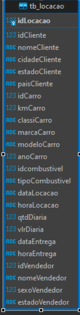
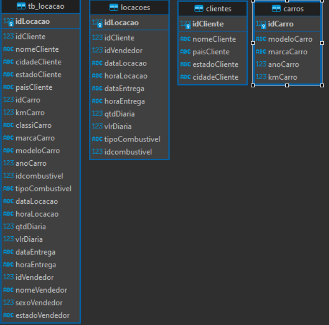
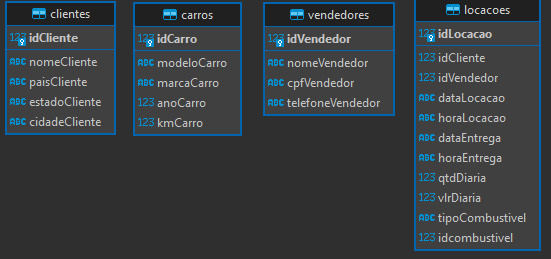

**Tarefa 1: Modelagem Relacional - Normalização**

**Passo 1: Criar as tabelas novas**

1. Primeiramente, o processo de criação do banco de dados "concessionária" envolveu a importação de um arquivo .txt no DBEaver, utilizando o SQLite como sistema de gerenciamento. Isso resultou na geração da tabela "tb_locações".

## ER Diagrama tb_locacao



2. Use o comando `CREATE TABLE` para criar cada tabela nova.

```
sqlite3 concessionaria.sqlite
```
```sql
# Cria a tabela `clientes`
CREATE TABLE clientes (
  idCliente INTEGER PRIMARY KEY,
  nomeCliente TEXT,
  paisCliente TEXT,
  estadoCliente TEXT,
  cidadeCliente TEXT
);

# Cria a tabela `carros`
CREATE TABLE carros (
  idCarro INTEGER PRIMARY KEY,
  modeloCarro TEXT,
  marcaCarro TEXT,
  anoCarro INTEGER,
  kmCarro INTEGER
);

# Cria a tabela `locacoes`
CREATE TABLE locacoes (
  idLocacao INTEGER PRIMARY KEY,
  idCliente INTEGER,
  idVendedor INTEGER,
  dataLocacao DATE,
  horaLocacao TIME,
  dataEntrega DATE,
  horaEntrega TIME,
  qtdDiaria INTEGER,
  vlrDiaria REAL,
  tipoCombustivel TEXT,
  idcombustivel INTEGER
);
```

# ER Diagrama tabelas criadas


**Passo 2: Inserir os dados**

1. Use o comando `INSERT INTO` para inserir os dados da tabela original nas tabelas novas correspondentes.

```sql
# Insere os dados da tabela `tb_locacao` na tabela `clientes`
INSERT INTO clientes (idCliente, nomeCliente, paisCliente, estadoCliente, cidadeCliente)
SELECT idCliente, nomeCliente, paisCliente, estadoCliente, cidadeCliente
FROM tb_locacao;

# Insere os dados da tabela `tb_locacao` na tabela `carros`
INSERT INTO carros (modeloCarro, marcaCarro,anoCarro, kmCarro)
SELECT modeloCarro, marcaCarro, anoCarro, kmCarro
FROM tb_locacao


# Insere os dados da tabela `tb_locacao` na tabela `locacoes`
INSERT INTO locacoes (idLocacao, idCliente, idVendedor, dataLocacao, horaLocacao, dataEntrega, horaEntrega, qtdDiaria, vlrDiaria, tipoCombustivel, idcombustivel)
SELECT idLocacao, idCliente, idVendedor, dataLocacao, horaLocacao, dataEntrega, horaEntrega, qtdDiaria, vlrDiaria, tipoCombustivel, idcombustivel
FROM tb_locacao;
```

**Explicação**

Os comandos acima criam as tabelas `clientes`, `carros` e `locacoes` no banco de dados `concessionaria.sqlite`. As tabelas `clientes` e `carros` possuem uma chave primária `id`. A tabela `locacoes` possui as chaves primárias `idLocacao` e `idCliente`.

O comando `INSERT INTO` insere os dados da tabela `aluguel_carros` nas tabelas novas correspondentes. O comando `SELECT` seleciona os dados da tabela `aluguel_carros` que você deseja inserir.

------------------------------------------------------------------
-----------------------------------------------------------------


# Tarefa 2: Modelagem Dimensional

A Modelagem Dimensional é uma abordagem de design de bancos de dados focada na facilidade de uso para análises, com duas estruturas principais:

## Fatos
Tabelas pequenas que armazenam medidas de interesse do negócio, como a tabela "Locações" na base de dados concessionaria.sqlite, que contém informações sobre aluguéis de carros.

## Dimensões
Tabelas maiores que descrevem atributos dos fatos. Exemplos na base de dados concessionaria.sqlite incluem "Clientes" (informações dos clientes), "Carros" (informações dos veículos) e "Vendedores" (informações dos vendedores).


**Modelagem Dimensional para a base de dados `concessionaria.sqlite`**

Com base no modelo relacional criado na seção anterior, podemos criar o seguinte modelo dimensional para a base de dados `concessionaria.sqlite`:

**Fatos**

```sql
CREATE TABLE locacoes (
  idLocacao INTEGER PRIMARY KEY,
  idCliente INTEGER,
  idVendedor INTEGER,
  dataLocacao DATE,
  horaLocacao TIME,
  dataEntrega DATE,
  horaEntrega TIME,
  qtdDiaria INTEGER,
  vlrDiaria REAL,
  tipoCombustivel TEXT,
  idcombustivel INTEGER
);
```

**Dimensões**

```sql
CREATE TABLE clientes (
  idCliente INTEGER PRIMARY KEY,
  nomeCliente TEXT,
  paisCliente TEXT,
  estadoCliente TEXT,
  cidadeCliente TEXT
);

CREATE TABLE carros (
  idCarro INTEGER PRIMARY KEY,
  modeloCarro TEXT,
  marcaCarro TEXT,
  anoCarro INTEGER,
  kmCarro INTEGER
);

CREATE TABLE vendedores (
  idVendedor INTEGER PRIMARY KEY,
  nomeVendedor TEXT,
  cpfVendedor TEXT,
  telefoneVendedor TEXT
);
```

## ER Dimensões e Fatos
